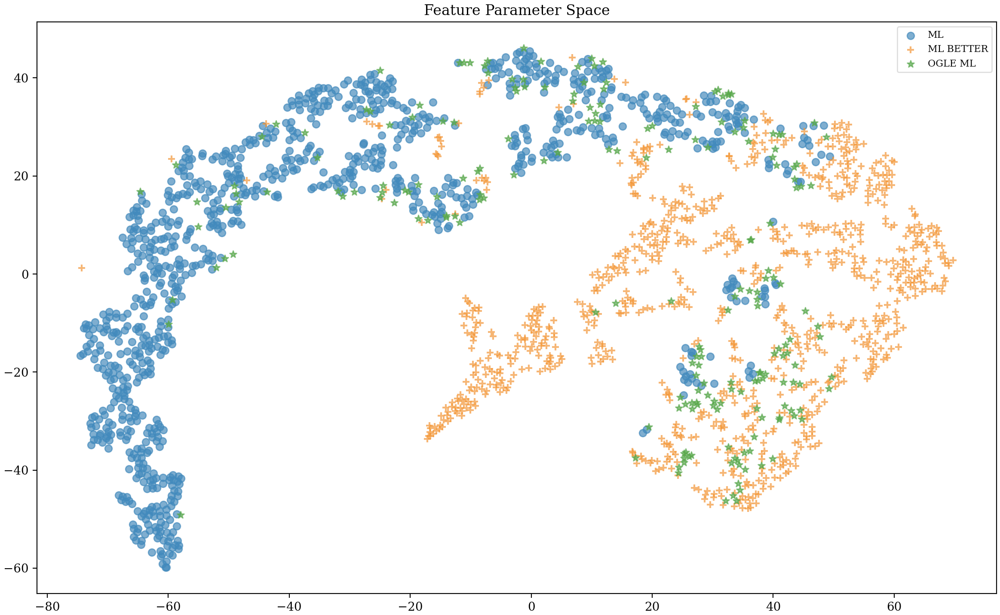

.. _Examples:

Example: OGLE II
==================
The lightcurves for 214 OGLE II microlensing events can be :download:`downloaded here <OGLE_II.zip>`.

Each file contains three columns: time, mag, magerr

We will train MicroLIA for OGLE II microlensing detection, and record how many of these 214 events we successfully recover using a leave-one-out cross-validatoion routine.

Training Set
-----------
Adaptive cadence is important as this allows MicroLIA to detect microlensing events even if the survey footprint is sparse. In this example we need to train the classifier using OGLE II cadence, which we can take to be the timestamps of these 214 lightcurves. To begin the training we need to append the time array of each lightcurve to a list:

.. code-block:: python

    import os
    import numpy as np

    path = 'OGLE_II/' 
    filenames = [file for file in os.listdir(path) if '.dat' in file]

    timestamps = []

    for name in filenames:
      time = np.loadtxt(path+name)[:,0]
      timestamps.append(time)

This timestamps list will be used to simulate our training data, as each time an event is simulated a timestamp from the list which will be chosen at random. In this example we will set the ``min_mag`` of the survey to be 15, and the ``max_mag`` to be 20. We will also set ``n_class`` = 50, this is the size of our training classes. The ``training_set`` module allows us to simulate our classes:

.. code-block:: python

   from MicroLIA import training_set

   data_x, data_y = training_set.create(timestamps, min_mag=15, max_mag=20, n_class=50)

There are a number of other parameters we can control when creating the training set, including exposure time and zeropoint of the survey telescope. Setting these parameters carefully will ensure that our training set matches what will be observed. **To be more accurate we will set these optional parameters and simulate 100 objects per class, in addition to including a first-order noise model using the rms and median mag of our OGLE II data.**

.. code-block:: python

   from MicroLIA import training_set, noise_models

   rms_mag = []
   median_mag = []

   for name in filenames:
      mag = np.loadtxt(path+name)[:,1]
      rms = 0.5*np.abs(np.percentile(mag,84) - np.percentile(mag,16))
      rms_mag.append(rms)
      median_mag.append(np.median(mag))

   ogle_noise = noise_models.create_noise(median_mag, rms_mag)

   data_x, data_y = training_set.create(timestamps, min_mag=np.min(median_mag), max_mag=np.max(median_mag), noise=ogle_noise, zp=22, exptime=30, n_class=100)

.. figure:: _static/simulation.jpg
    :align: center
|
This will simulate the lightcurves for our training set, all of which will be saved by default in the 'lightcurves.fits' file, organized by class and ID. The other file is called 'all_features.txt', and contains the statistical metrics of each lightcurve, with the first line containing a '#' comment with the feature names of each column, although please note that the first column of this file is the class of each simulated object (str), and the second columns is the corresponding unique ID. 

**As of version 2.0, a pandas dataframe will automatically be saved for easier access to the individual metrics, titled 'MicroLIA_Training_Set.csv'.**

.. code-block:: python
   
   from pandas import read_csv

   csv_file = read_csv('MicroLIA_Training_Set.csv')

   from MicroLIA import ensemble_model
   
   model = ensemble_model.Classifier(csv_file=csv_file)

Even though these files are saved by default, this function will also return two outputs: the statistical metrics (``data_x``), and the corresponding class labels (``data_y``), which can always be loaded directly from the 'all_features.txt' file. There are additional parameters that can be controlled when creating the training set, including arguments that control the "quality" of the simulated microlensing and cataclysmic variable lightcurves. These parameters control the number of measurements that must be within the signals -- this is especially important to tune if the cadence of the survey is sparse, as per the random nature of the simulations some signals may contain too few points within the transient event to be properly detected. 

If poor lightcurves are simulated the classifier will be heavily biased, as these signals may appear as noisy constants if the event is not adequately captured. This discrepancy between the assigned class label and the characteristics of the simulated signal will impact the generalization and thus the performance of the classifier. Please refer to the  `API documentation <https://microlia.readthedocs.io/en/latest/autoapi/MicroLIA/training_set/index.html>`_ for more information on tuning these parameters.

Ensemble Classification Engine
-----------
We will create our ensemble machine learning model using the statistical features of the lightcurves, which are saved in the 'all_features.txt' file when the training set was genereated. The first column is the lightcurve class, and therefore will be loaded as our training labels. The second column is the unique ID of the simulated lightcurve, which will be ignored. 

In this example we will load this file from which we can create our data_x and data_y arrays, although note above that the training set routine returns ``data_x`` and ``data_y`` as outputs, therefore this example is to simply demonstrate how to generally load the saved training data post-generation (if need-be we can always re-compute the statistics using the `extract_features <https://microlia.readthedocs.io/en/latest/autoapi/MicroLIA/extract_features/index.html>`_) module.

.. code-block:: python
   
   from pathlib import Path

   data = np.loadtxt(str(Path.home()) + '/all_features.txt', dtype=str, comments='#') #By default the file is saved in the home directory

   data_x = data[:,2:].astype('float')
   data_y = data[:,0]
   
With our training data loaded we can create our machine learning engine with MicroLIA's `models <https://microlia.readthedocs.io/en/latest/autoapi/MicroLIA/models/index.html>`_ module. When training the model three optimization procedures can be enabled:

-  Missing values (NaN) will be imputed using the `sklearn implementation of the k Nearest Neighbors imputation algorithm <https://scikit-learn.org/stable/modules/generated/sklearn.impute.KNNImputer.html>`_. The imputer will be saved so that it can be applied to transform new, unseen data, serving as a means to address the issue of missing data values. 

-  The features that contain useful information will be selected using `BorutaShap <https://zenodo.org/record/4247618>`_, a procedure based off of the Boruta algorithm developed by `Kursa and Rudnicki 2011 <https://arxiv.org/pdf/1106.5112.pdf>`_. BorutaShap method improves upon the original algorithm by coupling its probabilistic approach to feature selection with `Shapley Values <https://christophm.github.io/interpretable-ml-book/shapley.html>`_. While bagging algorithms like the Random Forest can be robust to irrelevant features, computation-wise, it is imperative that we compute only the features that are helpful.

-  Finally, the model hyperparameters will be optimized using the hyperparameter optimization software `Optuna <https://optuna.org/>`_, developed by `Akiba et al 2019 <https://arxiv.org/abs/1907.10902>`_. The default sampler Optuna employs is the Tree Parzen Estimator, a Bayesian optimization approach that effectively reduces the error by narrowing the search space according to the performance of previous iterations, therefore in principle it is best to increase the number of trials to perform.

As these three methods are disabled by default, we can create and optimize an XGBoost classifier using the following code:

.. code-block:: python

   from MicroLIA import ensemble_model

   model = ensemble_model.Classifier(data_x, data_y, clf='xgb', impute=True, optimize=True, n_iter=25, boruta_trials=25)
   model.create()

To avoid overfitting during the optimization procedure, 3-fold cross-validation is performed to assess performance at the end of each trial, therefore the hyperparameter optimization can take a long time depending on the size of the training set and the algorithm being optimized. This setting can be tuned using the ``opt_cv`` argument.

Note that the ``ensemble_model`` module currently supports three machine learning algorithms: Random Forest, Extreme Gradient Boosting, and Neural Network. While ``clf`` = 'rf' for Random Forest is the default input, we can also set this to 'xgb' or 'nn'. 

Since our neural network implemtation requires more tuning to properly identify the optimal combination of layers and neurons, it is recommended to set ``n_iter`` to at least 100, as by default only 25 trials are performed when optimizing the hyperparameters. Note that there is also a ``boruta_trials`` argument which sets the number of iterations to perform when calculating feature importance. If ``boruta_trials`` = 0, then all the features will be used. Use ``model.plot_feature_opt()`` to visualize the feature selection results.

For details on how to set the classifier and the accompanying optimization parameters, refer to the `ensemble_model <https://microlia.readthedocs.io/en/latest/autoapi/MicroLIA/models/index.html#MicroLIA.models.create>`_ API reference.

Saving & Loading Models
-----------
Once a model is created we can save the model file alongside any additional attributes using the save class method, which saves the model, imputer, feats_to_use, optimization_results, best_params, and feature_history, if applicable. Unless a ``path`` argument is specified when saving, the files are saved to a folder in the local home directory, which will print upon saving. This folder will be titled 'MicroLIA_ensemble_model'.

.. code-block:: python

   model.save()

To load the model in the future:

.. code-block:: python
   
   model = ensemble_model.classifier()
   model.load()

The load() attribute also takes an optional path argument, as by default it will look for the data in local home directory as well. Once loaded, the model object will contain the attributes that were initially saved as well as the trained model, which is used when calling the predict and/or any of the visualization methods described below.

Data Visualization
-----------
The training set consists of only simulated lightcurves, to see the classification accuracies among the simulations we can create a confusion matrix using the built-in function in the class object. By default the matrix displays mean accuracy after 10-fold cross-validation, but this can be controlled with the ``k_fold`` parameter. 

.. code-block:: python

   model.plot_conf_matrix()

When using the XGBoost classifier, the class labels are automatically converted to numerical representations, to override these numerical labels for visualization purposes we can load the saved pandas DataFrame and thus the corresponding ``data_y`` labels directly (**if the ``csv_file`` argument is used to load the data, the data_y argument when plotting the confusion matrix is automatically set to the dataframe column names, and thus the below steops are only necessary if you wish to overwrite the default column names (for publication)**):

.. code-block:: python

   import pandas as pd

   stats = pd.read_csv('MicroLIA_Training_Set.csv')
   data_y = stats.label

   model.plot_conf_matrix(data_y=data_y, savefig=True)

From this csv file we can also load the feature names corresponding to the the data_x array, which can be used when plotting the feature selection history:

.. code-block:: python

   feat_names = stats.columns[:-1] #The last column is the label

   model.plot_feature_opt(feat_names=feat_names, top=10, include_other=True, include_shadow=True, include_rejected=True, flip_axes=True, save_data=True, savefig=True)

In addition to the feature selection history, the hyperparameter optimization results, including the importance of each hyperparameter in terms of its contribution to classification accuracy and training time, can be visualized using the following methods:

.. code-block:: python

   #Plot the hyperparameter optimization history
   model.plot_hyper_opt(xlim=(1,25), xlog=True)

   #Need to save the importances first, must run once the first time!
   model.save_hyper_importance()

   #Plot the hyperparameter importances
   model.plot_hyper_param_importance()
   model.plot_hyper_param_importance(plot_time=True)

Finally, we can also plot a two-dimensional t-SNE projection, which requires only the dataset. To properly visualize the feature space when using the eucledian distance metric, we will set norm=True so as to min-max normalize all the features for proper scaling:

.. code-block:: python

   model.plot_tsne(data_y=data_y, norm=True, savefig=True)

It would be nice to include the parameter space of the real OGLE II microlensing lightcurves, to visualize how representative of real data our training set is. To include these in the t-SNE projection we can save the statistics of the OGLE II lightcurves and append them to the data_x array. As for the label, we can label these 'OGLE ML' which will also be appended to the data_y array. For this excervise see the example discussed in the Important Note section of this page.

Model Performance
-----------
With the optimized model saved, as well as our imputer and indices of features to use, we can begin classifying any lightcurve using the predict() class method. Let's load the first OGLE II microlensing lightcurve and check what the prediction is:

.. code-block:: python

   data = np.loadtxt('OGLE_II/'+filenames[0])
   time, mag, magerr = data[:,0], data[:,1], data[:,2]

   prediction = model.predict(time, mag, magerr, convert=True, zp=22)

Note that by default ``convert`` = True, which will convert the magnitude input to flux, therefore we must set the appropriate zeropoint argument. This zp must match whatever value was used when creating the training set, in this example ``zp`` = 22. 

The prediction output is the label and probability prediction of each class, ordered in alphabetical order. The predicted class in this case is 'ML', as the corresponding classification accuracy of is higher than all the others. Finally, let's load all 214 lightcurves and check the overall prediction accuracy:

.. code-block:: python

   predictions = [] #Empty list to store only the prediction label

   for name in filenames:
      data = np.loadtxt(path+name)
      time, mag, magerr = data[:,0], data[:,1], data[:,2]
      prediction = model.predict(time, mag, magerr, convert=True, zp=22)
      predictions.append(prediction[np.argmax(prediction[:,1])][0])

   accuracy = len(np.argwhere(predictions == 'ML'))/len(predictions)
   print('Total accuracy :{}'.format(np.round(accuracy, 4)))

The accuarcy is over 0.97, that's very good, but to be more certain, let's classify some random variable lightcurves. The photometry for 91 OGLE II variable stars can be :download:`downloaded here <variables.zip>`. 

.. code-block:: python

   path = str(Path.home())+'/variables/'
   filenames = os.listdir(path)

   for name in filenames:
      data = np.loadtxt(path+name)
      time, mag, magerr = data[:,0], data[:,1], data[:,2]
      prediction = model.predict(time, mag, magerr, convert=True, zp=22)
      predictions.append(prediction[np.argmax(prediction[:,1])][0])

   predictions = np.array(predictions)
   false_alert = len(np.argwhere(predictions == 'ML'))/len(predictions)
   print('False alert rate: {}'.format(np.round(false_alert, 4)))

A false-positive rate of ~0.15 is very high, upon visual inspection we can see there are two issues with this data: low cadence and high noise. Our engine is only as accurate as our training set, to show this we can re-create our training data using this sample of variables. We will simulate lightcurves with this particular cadence and noise, and while we can set a filename argument, to avoid overwriting our files from our previous run, we will set save_file=False:

.. code-block:: python

   timestamps = []
   for name in filenames:
      time = np.loadtxt(path+name)[:,0]
      timestamps.append(time)

   rms_mag = []
   median_mag = []

   for name in filenames:
      mag = np.loadtxt(path+name)[:,1]
      rms = 0.5*np.abs(np.percentile(mag,84) - np.percentile(mag,16))
      rms_mag.append(rms)
      median_mag.append(np.median(mag))

   ogle_noise = noise_models.create_noise(median_mag, rms_mag)

   data_x, data_y = training_set.create(timestamps, min_mag=np.min(median_mag), 
         max_mag=np.max(median_mag), noise=ogle_noise, zp=22, 
         exptime=30, n_class=100, save_file=False)

Finally, we will create a new model and re-predict the class of these variables:

.. code-block:: python
   
   new_model = ensemble_model.Classifier(data_x, data_y, clf='xgb', optimize=True, impute=True, n_iter=25, boruta_trials=25)
   new_model.create()

   predictions=[]
   for name in filenames:
      data = np.loadtxt(path+name)
      time, mag, magerr = data[:,0], data[:,1], data[:,2]
      prediction = new_model.predict(time, mag, magerr, convert=True, zp=22)

      predictions.append(prediction[np.argmax(prediction[:,1])][0])

   predictions = np.array(predictions)
   false_alert = len(np.argwhere(predictions == 'ML'))/len(predictions)
   print('False alert rate: {}'.format(np.round(false_alert, 4)))

The false-positive rate in this instance is ~0.03, very nice! But what if we now predict the class of the original 214 microlensing lightcurves? This new model was tuned using the variable lightcurves, so we would expect the accuracy to drop. After classifying these 214 lightcurves with this new model, only 0.63 were classified as microlensing -- better than random, but quite a ways from our initial 0.97 prediction accuracy!

The best course of action is to re-create the training set using the timestamps and noise from the 214 microlensing and the 91 variable lightcurves. With this larger OGLE II sample we will more accurately capture the survey conditions. Sure enough, upon creating a new model with this new training data, the microlensing accuracy went back up to 0.96, and the false-alert rate among variables went back down to 0.03.

IMPORTANT: It is imperative to remember always that the accuracy of the classifier depends on the accuracy of the training set. Tuning the parameters carefully when creating the training data is important, as is the need for a large sample of real data if available.

Important Note
-----------
To re-iterate the importance of finely tuning the creation of the training data, see the code below used to construct a "basic" and a "better" training set, and compare the parameter space of the simulated microlensing lightcurves with the real OGLE II events. This feature visualization is performed using MicroLIA.models.classifier.plot_tsne. If the parameters of our simulations and the true events inhabit the same parameter space, then this would indicate that our simulations are characteristic of what would be new, unseen data. 

.. code-block:: python

   import os
   import numpy as np 
   from MicroLIA import training_set, ensemble_model, noise_models
   from MicroLIA.extract_features import extract_all

   #Save the filename of the 214 lightcurves (.dat extension)
   path = '/Users/daniel/Desktop/Backups/OGLE_II/'
   filenames = [file for file in os.listdir(path) if '.dat' in file]

   #Load each file and append timestamps
   timestamps = []
   for name in filenames:
     timestamps.append(np.loadtxt(path+name)[:,0])

   #Calculate rms vs median mag for noise model
   rms_mag = []
   median_mag = []
   for name in filenames:
     mag = np.loadtxt(path+name)[:,1]
     rms = 0.5*np.abs(np.percentile(mag,84) - np.percentile(mag,16))

     rms_mag.append(rms)
     median_mag.append(np.median(mag))

   #Create noise model using MicroLIA.noise_models.create_noise()
   ogle_noise = noise_models.create_noise(median_mag, rms_mag)

   #Create basic training set using timestamps only, each class simulated 214 times
   data_x, data_y = training_set.create(timestamps, n_class=len(filenames))

   #Index for only microlensing for better tSNE projection 
   index = np.where(data_y == 'ML')[0]

   #Create better training set using noise model and zp, exp time, & min/max mag.
   data_x_better, data_y_better = training_set.create(timestamps, min_mag=np.min(median_mag), max_mag=np.max(median_mag), noise=ogle_noise, zp=22, exptime=30, n_class=len(filenames), save_file=False)
   
   #Add word "BETTER" to the labels 
   data_y_better = [label+'_BETTER' for label in data_y_better]

   #Combine data of basic and better training sets
   data_x = np.concatenate((data_x[index], data_x_better[index]))
   data_y = np.r_[data_y[index], data_y_better[index]]

   #Construct data_x for OGLE II microlensing events
   #Can extract features manually using MicroLIA.extract_features.extract_all()
   ogle_data_x=[]
   ogle_data_y=[]

   for name in filenames:
     data = np.loadtxt(path+name)
     time, mag, magerr = data[:,0], data[:,1], data[:,2]
     stats = extract_all(time, mag, magerr, zp=22)

     ogle_data_x.append(stats)
     ogle_data_y.append('OGLE ML')

   ogle_data_x = np.array(ogle_data_x)
   ogle_data_y = np.array(ogle_data_y)

   #Combine data again
   x = np.concatenate((data_x, ogle_data_x))
   y = np.r_[data_y, ogle_data_y]

   #Create model object
   model = models.classifier(x, y)

   #Call plot_tsne attribute
   model.plot_tsne()

.. figure:: _static/tsne_214.png
    :align: center
|

In the above example n_class was set to 214 for both simulations, so as to match the number of true samples that we have. Given the randommness of the simulations, it is not surprising to see regions of no feature overlap. If we create new training sets with a higher n_class argument, we will more generally capture the microlensing parameter space and we would expect the OGLE microlensing to be completely encapsulated by the larger sample.

If we run above code again with n_class=1000, the feature space looks like this:

|

Unlike simulations, real data can be messy and difficult to properly preprocess. If you notice a lot of misclassifications, it would be because the simulations don't reflect the real data; therefore it is good to double check by visualizing the high-dimensional feature space of our simulated and target lightcurves.
