.. _Examples:

Example: OGLE II
==================
The lightcurves for 214 OGLE II microlensing events can be :download:`downloaded here <OGLE_II.zip>`.

Each file contains three space-delimited columns: time, mag, magerr

We will train MicroLIA for OGLE II microlensing detection, and record how many of these 214 events we can successfully recover using a training set of simulated lightcurves.

Training Set
-----------
Adaptive cadence is extremely important as this allows MicroLIA to detect microlensing events even if the survey footprint is sparse. In this example we will train the classifier using OGLE II cadence, which we can take to be the timestamps of these 214 lightcurves. To begin the training, we need to append the time array of each lightcurve to a list:

.. code-block:: python

   import os
   import numpy as np

   path = 'OGLE_II/' 
   filenames = [file for file in os.listdir(path) if '.dat' in file]

   timestamps = []

   for name in filenames:
      time = np.loadtxt(path+name)[:,0]
      timestamps.append(time)

This timestamps list will be used to simulate the training data, as each time a lightcurve is simulated a timestamp from the list will be random selected. In this example, we will set the ``min_mag`` of the survey to be 15, and the ``max_mag`` to be 20. We will also set ``n_class`` to be 100, which corresponds to the size of each training class. The ``training_set`` module simulates the lightcurves:

.. code-block:: python

   from MicroLIA import training_set

   data_x, data_y = training_set.create(timestamps, min_mag=15, max_mag=20, n_class=100)

There are a number of other parameters we can control when creating the training set, including the exposure time and zeropoint of the survey telescope and whether or not to apply the photometric errors to calculate the statistical metrics (``apply_weights``). Setting these parameters carefully will ensure that our training set matches what will be observed. **To be more accurate we will set these optional parameters and simulate 100 objects per class, in addition to including a first-order noise model using the rms and median mag of our OGLE II data.**

.. code-block:: python

   from MicroLIA import training_set, noise_models

   rms_mag, median_mag = [], []

   for name in filenames:
      mag = np.loadtxt(path+name)[:,1]
      rms = 0.5*np.abs(np.percentile(mag,84) - np.percentile(mag,16))
      rms_mag.append(rms); median_mag.append(np.median(mag))

   ogle_noise = noise_models.create_noise(median_mag, rms_mag)

   data_x, data_y = training_set.create(timestamps, min_mag=np.min(median_mag), max_mag=np.max(median_mag), noise=ogle_noise, zp=22, exptime=30, n_class=100, apply_weights=True)

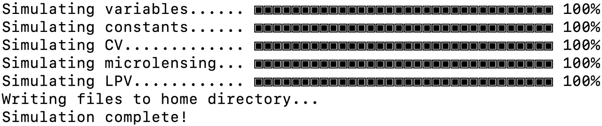
|
The simulated lightcurves will be saved by default in a 'lightcurves.fits' file, organized by class and ID. This file once loaded can be used to plot the simulated lightcurves using the `plot <https://microlia.readthedocs.io/en/latest/_modules/MicroLIA/training_set.html#plot>`_ function. A file called 'all_features.txt' will be saved as well, containing the statistical metrics of each lightcurve, with the first column containing the class of each simulated object (``str``), and the second columns the corresponding unique ID (``int``). 

**As of version 2.0, a pandas dataframe will automatically be saved for easier access to the individual metrics, titled 'MicroLIA_Training_Set.csv', which can be loaded post-processing as follows:**

.. code-block:: python
   
   from pandas import read_csv

   csv_file = read_csv('MicroLIA_Training_Set.csv')

   from MicroLIA import ensemble_model
   
   model = ensemble_model.Classifier(csv_file=csv_file)

Even though these files are saved by default, `create <https://microlia.readthedocs.io/en/latest/autoapi/MicroLIA/training_set/index.html#MicroLIA.training_set.create>`_ function will also return two outputs: the statistical metrics (``data_x``), and the corresponding class labels (``data_y``), which can always be loaded directly from the saved 'all_features.txt' file. 

There are additional parameters that can be called when creating the training set, including arguments that control the "quality" of the simulated microlensing and cataclysmic variable lightcurves. These parameters control the number of measurements that must be within the observed signals -- this is especially important to tune if the cadence of the survey is sparse, as per the random nature of the simulations, some signals may contain too few points within the transient event to be properly detected and classified. 

If poor lightcurves are simulated in which the event is not adequately captured, the classifier will be heavily biased, as these lightcurves may not be representative of the actual class. This discrepancy between the assigned class label and the characteristics of the simulated signal will impact the generalization and thus the performance of the classifier, please refer to the  `API documentation <https://microlia.readthedocs.io/en/latest/autoapi/MicroLIA/training_set/index.html>`_ for more information on tuning these parameters.

Ensemble Classification Engine
-----------
We will create our ensemble machine learning model using the statistical features of the lightcurves, which are saved in the 'all_features.txt' file when the training set was genereated. The first column is the lightcurve class, and therefore will be loaded as our training labels. The second column is the unique ID of the simulated lightcurve, which will be ignored. 

In this example we will load this file to re-generate the data_x and data_y arrays, although note above that the training set routine returns ``data_x`` and ``data_y`` as outputs, and more conveniently, the ``csv_file`` can be input instead (and if need-be the statistics can always be re-computed using the `extract_features <https://microlia.readthedocs.io/en/latest/autoapi/MicroLIA/extract_features/index.html>`_) function.

.. code-block:: python
   
   from pathlib import Path

   data = np.loadtxt(str(Path.home()) + '/all_features.txt', dtype=str, comments='#') #By default the file is saved in the home directory

   data_x = data[:,2:].astype('float')
   data_y = data[:,0]
   
With the training data loaded we can create the machine learning engine with MicroLIA's `models <https://microlia.readthedocs.io/en/latest/autoapi/MicroLIA/models/index.html>`_ module. When training the model three optimization procedures can be enabled:

-  Missing values (NaN) can be imputed using by setting ``impute`` to True. By default this applies the `sklearn implementation of the k Nearest Neighbors imputation algorithm <https://scikit-learn.org/stable/modules/generated/sklearn.impute.KNNImputer.html>`_. The imputer will be saved as a class attribute so that it can be applied to transform new, unseen data, serving as a means to address the issue of missing data values. 

-  The features that contain useful information can be selected by setting ``optimize`` to True and a non-zero ``boruta_trials`` argument. This will apply `BorutaShap <https://zenodo.org/record/4247618>`_, a procedure based off of the Boruta algorithm developed by `Kursa and Rudnicki 2011 <https://arxiv.org/pdf/1106.5112.pdf>`_. BorutaShap improves upon the original algorithm by coupling its probabilistic approach to feature selection with `Shapley Values <https://christophm.github.io/interpretable-ml-book/shapley.html>`_. While bagging algorithms like the Random Forest can be robust to irrelevant features, we find that it in practice it is important to compute only the relevant features for the task at hand.

-  Finally, the model hyperparameters will be optimized if ``optimize`` is True and ``n_iter`` is a non-zero argument, using the hyperparameter optimization software `Optuna <https://optuna.org/>`_, developed by `Akiba et al 2019 <https://arxiv.org/abs/1907.10902>`_. The default sampler Optuna employs is the Tree Parzen Estimator, a Bayesian optimization approach that effectively reduces the error by narrowing the search space according to the performance of previous iterations, therefore in principle it is best to increase the ``n_iter`` parameter.

Note that these three options are disabled by default, therefore to create and optimize an XGBoost classifier using the above procedures we can create the model as such:

.. code-block:: python

   from MicroLIA import ensemble_model

   model = ensemble_model.Classifier(data_x, data_y, clf='xgb', impute=True, optimize=True, n_iter=100, boruta_trials=100)
   model.create()

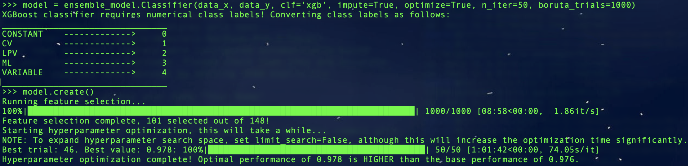
|
To avoid overfitting during the optimization procedure, 10-fold cross-validation is enabled by default to assess performance at the end of each trial, therefore the hyperparameter optimization can take a long time depending on the size of the training set and the algorithm being optimized. This setting can be tuned using the ``opt_cv`` argument, which can be set to 1 to do only one split and avoid cross-validation altogether.

Note that the ``ensemble_model`` module currently supports three machine learning algorithms: Random Forest, Extreme Gradient Boosting, and Neural Network. While ``clf`` = 'rf' for Random Forest is the default input, we can also set this to 'xgb' or 'nn'. Since the neural network implementation requires more tuning to properly identify the optimal combination of layers and neurons, it is recommended to set ``n_iter`` to at least 100. Note that there is also a ``boruta_trials`` argument which sets the number of iterations to perform when calculating feature importance. If ``boruta_trials`` = 0, then all the features will be used. The ``model.plot_feature_opt()`` class method can be used to visualize the feature selection results.

For details on how to set the classifier and the accompanying optimization parameters, refer to the `ensemble_model <https://microlia.readthedocs.io/en/latest/autoapi/MicroLIA/models/index.html#MicroLIA.models.create>`_ API documentation.

Saving & Loading Models
-----------
Once a model is created we can save the model alongside any additional attributes using the save class method, which saves the model, imputer, feats_to_use, optimization_results, best_params, and feature_history, if applicable. Unless a ``path`` argument is specified when saving, the files are saved to a folder in the local home directory. This folder will be titled 'MicroLIA_ensemble_model', which by design is must be the folder name where the model files are saved.

.. code-block:: python

   model.save(dirname='test_model', path=None)

To load the model in the future:

.. code-block:: python
   
   import pandas as pd 

   csv = pd.read_csv('MicroLIA_Training_Set.csv')
   model = ensemble_model.Classifier(clf='xgb', csv_file=csv)
   model.load(path='test_model')

Note that by default the load method will look for the data folder in local home directory. By default this folder is called 'MicroLIA_ensemble_model'. Once loaded, the class object will contain the attributes that were initially saved as well as the trained model, which can be used to predict unseen samples and/or display any of the visualization methods described below.

Data Visualization
-----------
To visualize the classification accuracies we can create a confusion matrix. By by default, the matrix displays the mean accuracy after 10-fold cross-validation, which can controlled with the ``k_fold`` parameter. For details regarding the confusion matrix generation, refer to the `docstring <https://microlia.readthedocs.io/en/latest/_modules/MicroLIA/ensemble_model.html#Classifier.plot_conf_matrix>`_.

.. code-block:: python

   model.plot_conf_matrix(k_fold=10)

When using the XGBoost classifier, the class labels are automatically converted to numerical representations, to override these numerical labels for visualization purposes we can input an accompanying ``data_y`` labels list as followws (**Note that if the ``csv_file`` argument was used to load the data, the data_y argument when plotting the confusion matrix is automatically set to the dataframe column names, and thus the below steps are only necessary if you wish to overwrite the default column names or if the data arrays were loaded manually.**):

.. code-block:: python

   y_labels = []

   for label in model.data_y:
      if label == 0:
         y_labels.append('CONSTANT')
      elif label == 1:
         y_labels.append('CV')
      elif label == 2:
         y_labels.append('LPV')
      elif label == 3:
         y_labels.append('ML')
      elif label == 4:
         y_labels.append('VARIABLE')

   model.plot_conf_matrix(data_y=y_labels, savefig=True)

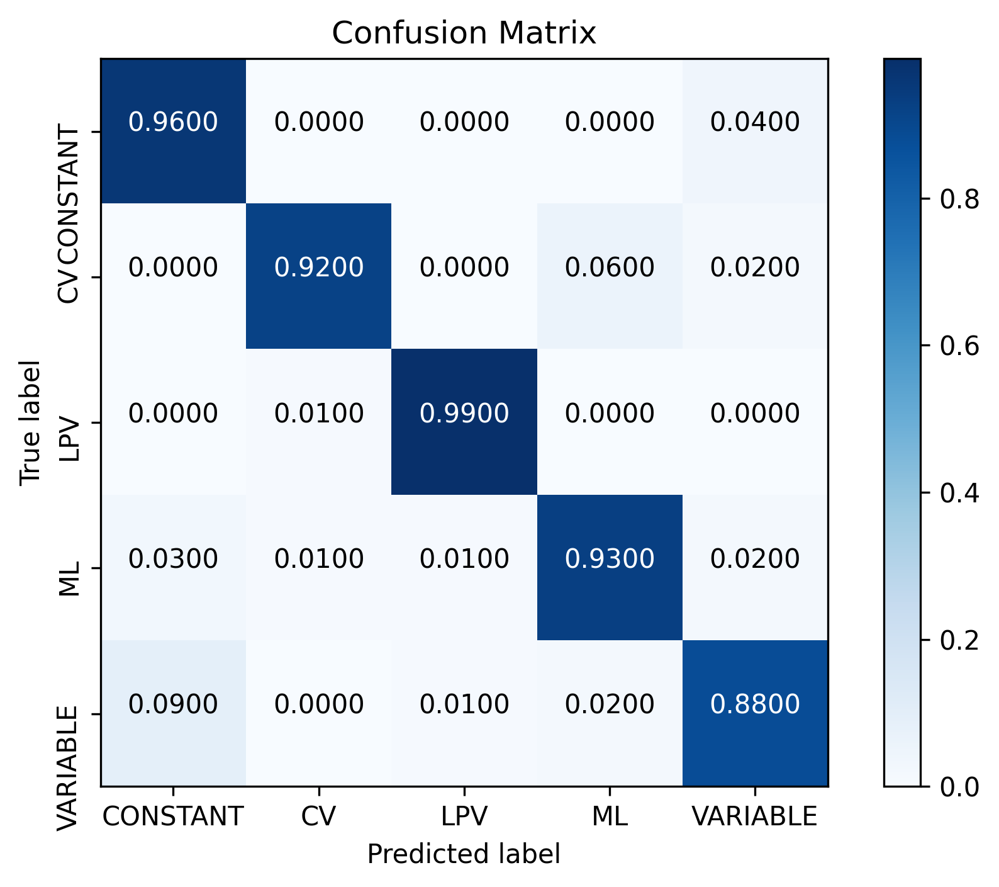
|
We can also plot a Receiver Operating Characteristic Curve, which currently does not support custom data_y labels:

.. code-block:: python

   model.plot_roc_curve(k_fold=10, savefig=True)

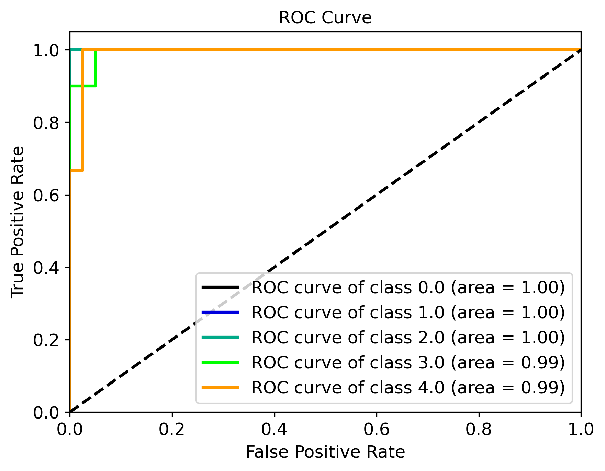
|
We can visualize the feature space using a two-dimensional t-SNE projection, which also takes in an optional ``data_y`` labels array to override the numerical class labels. To properly visualize the feature space when using the eucledian distance metric, we will set norm=True so as to min-max normalize all the features for proper scaling:

.. code-block:: python

   model.plot_tsne(data_y=y_labels, norm=True, savefig=True)

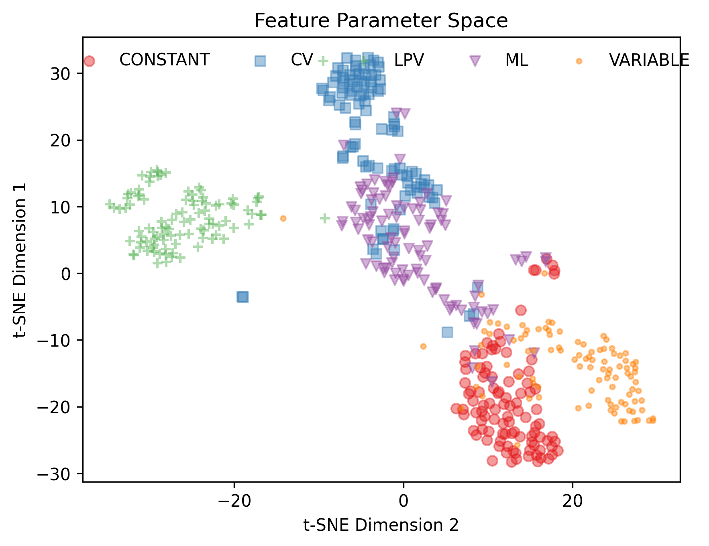
|
In a similar note, we can plot the feature selection history as output by the BorutaShap optimizer, which by default will associate the feature names with the index at which they are present in the ``data_x`` array; unless the ``csv_file``  argument was input when creating the model, in which case the column names will be used to represent the features. To override this at any point, we can input a custom ``feat_names`` list containing the custom names, especially helpful for publication purposes where we may wish to properly format the feature names and/or include special characters. Since in this example we have loaded the csv file that was saved after the training set was created, we can leave ``feat_names`` as None to default them to the column names, or, better yet, we can set ``feat_names``='default', which is only applicable if the features in the input `data_x` array were calculated using program's `features <https://microlia.readthedocs.io/en/latest/autoapi/MicroLIA/features/index.html>`_. module (thus not applicable if the features were computed manually or only a select quantity were computed).

.. code-block:: python

   model.plot_feature_opt(feat_names='default', top=20, include_other=True, include_shadow=True, include_rejected=False, flip_axes=False, save_data=True, savefig=True)

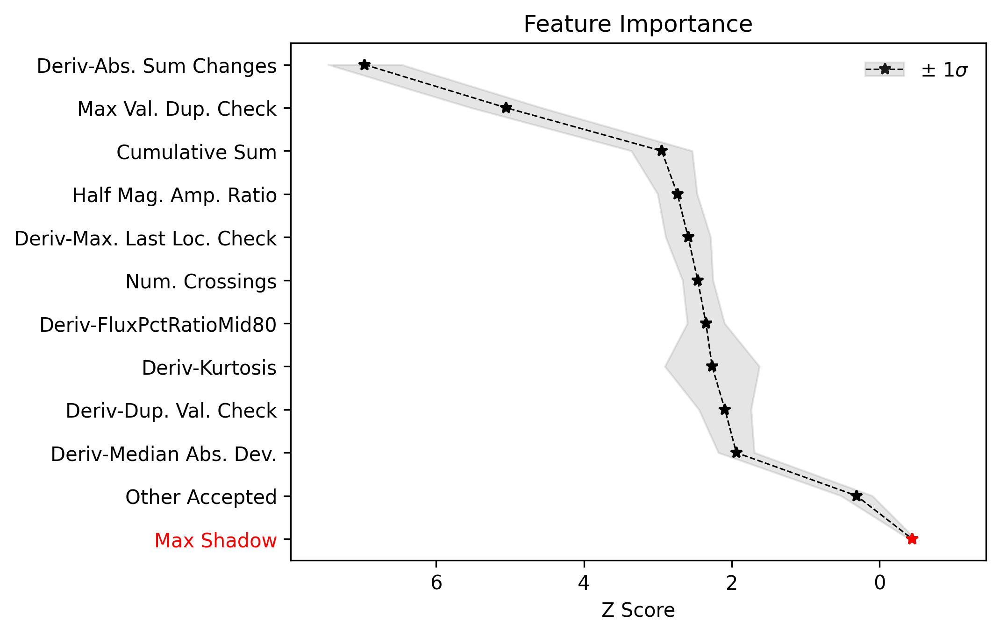
|
Note that the 'Deriv-' flag indicates that the metric was computed in the lightcurve's derivative space. In addition to the feature selection history, the hyperparameter optimization results, including the importance of each hyperparameter in terms of its contribution to classification accuracy and training time, can be visualized using the following methods:

.. code-block:: python

   #Plot the hyperparameter optimization history
   model.plot_hyper_opt(xlim=(1,100), ylim=(0.85,0.95), xlog=True, savefig=True)

   #Need to save the importances first, must run once the first time!
   model.save_hyper_importance()

   #Plot the hyperparameter importances
   model.plot_hyper_param_importance(plot_time=True, savefig=True)

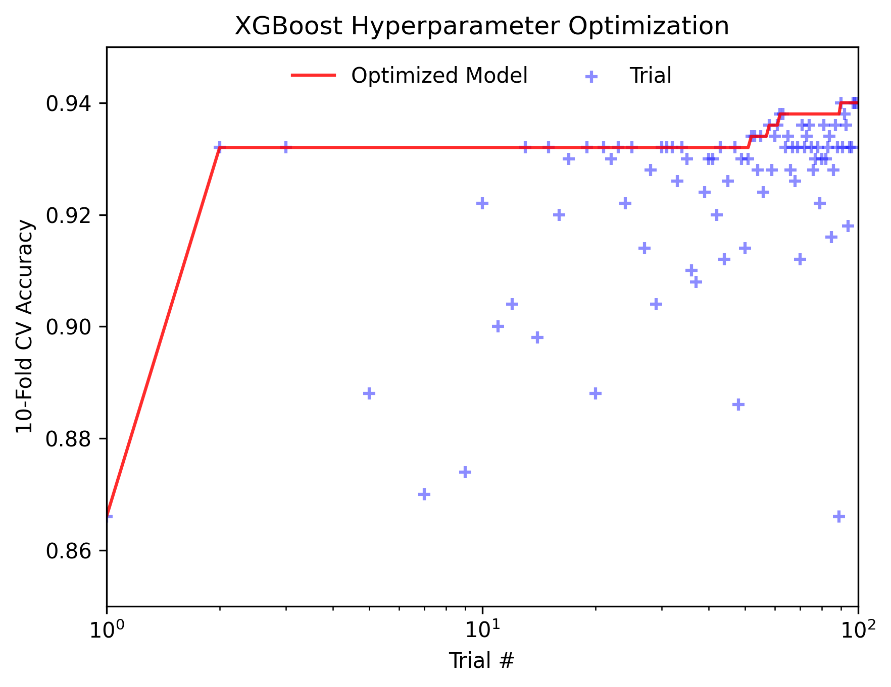
|
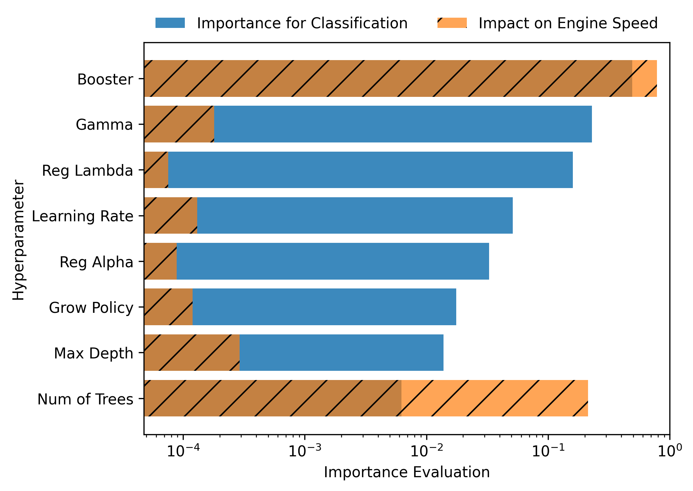
|
It would be nice to include the parameter space of the real OGLE II microlensing lightcurves in comparison to the simulated lightcurves, so as to visualize how representative of real data our training set is. To include these in the t-SNE projection we can save the statistics of the real OGLE II lightcurves and append them to the ``data_x`` array. As for the label, we can label these 'OGLE_ML' which will be appended to the ``data_y`` array. 

.. code-block:: python
   
   from MicroLIA.extract_features import extract_all

   path = 'OGLE_II/' 
   filenames = [file for file in os.listdir(path) if '.dat' in file]

   ogle_data_x, ogle_data_y = [], []

   # Save the stats of each ML lightcurve manually
   for name in filenames:
     data = np.loadtxt(path+name)
     time, mag, magerr = data[:,0], data[:,1], data[:,2]
     stats = extract_all(time, mag, magerr, convert=True, zp=22, apply_weights=True)
     ogle_data_x.append(stats); ogle_data_y.append('OGLE_ML')

   ogle_data_x, ogle_data_y = np.array(ogle_data_x), np.array(ogle_data_y)

   # Create a new model, only need to specify the training set csv
   new_model = ensemble_model.Classifier(csv_file=csv)
   new_model.load('test_model')

   # Add the OGLE ML data arrays
   new_model.data_x = np.concatenate((new_model.data_x, ogle_data_x))
   new_model.data_y = np.r_[new_model.data_y, ogle_data_y]

   # Plot the t-SNE projection
   new_model.plot_tsne(data_y=new_model.data_y,savefig=True)

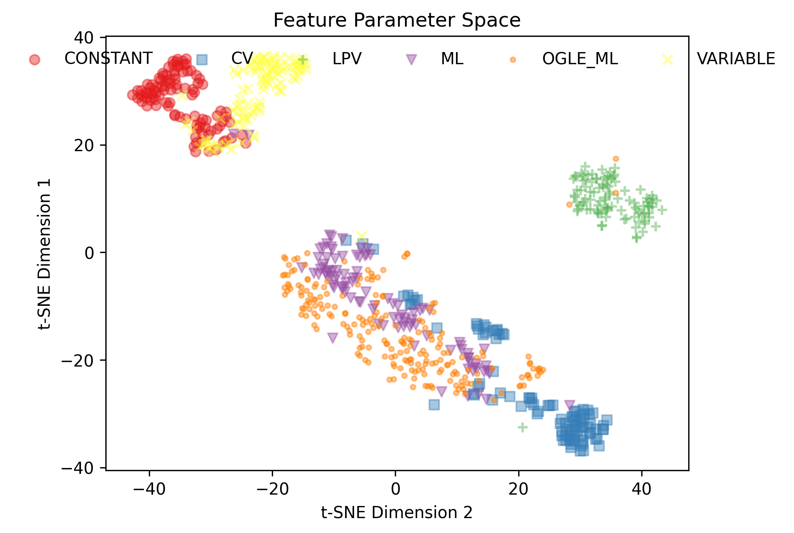
|
As expected, the simulated microlensing lightcurves (ML) overlap with the real OGLE II microlensing events (OGLE_ML). Unlike simulations, real data can be messy and difficult to properly preprocess. If you notice a lot of misclassifications, it would be because the simulations don't reflect the real data; therefore it is good to double check by visualizing the high-dimensional feature space of the simulated and target lightcurves.

Model Performance
-----------
With the optimized model saved, as well as the imputer and indices of useful features to use, we can begin classifying any lightcurve using the `predict <https://microlia.readthedocs.io/en/latest/_modules/MicroLIA/ensemble_model.html#Classifier.predict>`_ class method. Let's load the first OGLE II microlensing lightcurve and check what the prediction is:

.. code-block:: python

   data = np.loadtxt('OGLE_II/'+filenames[0])
   time, mag, magerr = data[:,0], data[:,1], data[:,2]

   prediction = model.predict(time, mag, magerr, convert=True, zp=22, apply_weights=True)

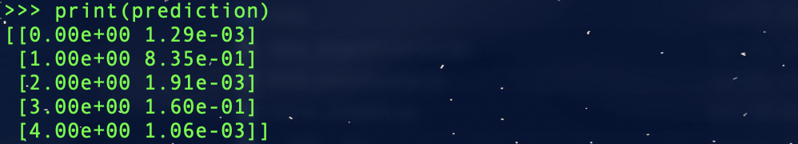
|
When predicting, the relevant statistis are computed for the input lightcurve(s). Note that by default ``convert`` = True, which will convert the magnitude input to flux, therefore we must set the appropriate zeropoint argument. This ``zp`` must match whatever value was used when creating the training set, in this example ``zp`` = 22. Likewise, since ``apply_weights`` was enabled when the training set was generated, we must insure we compute the statistics the same way by also setting this flag when doing the predictions.

The prediction output is the label and probability prediction of each class, ordered in alphabetical/numerical order. The predicted class in this case is '1' corresponding to the 'CV' class, as the corresponding classification accuracy of this class is higher than all the others; followed by label '3' which is 'ML'. Finally, let's load all 214 lightcurves and check the overall prediction accuracy:

.. code-block:: python

   predictions = [] #Empty list to store only the prediction label

   for name in filenames:
      data = np.loadtxt(path+name)
      time, mag, magerr = data[:,0], data[:,1], data[:,2]
      prediction = model.predict(time, mag, magerr, convert=True, zp=22, apply_weights=True)
      predictions.append(prediction[np.argmax(prediction[:,1])][0])

   predictions = np.array(predictions)
   accuracy = len(np.argwhere(predictions == 3)) / len(predictions)
   print('Total accuracy :{}'.format(np.round(accuracy, 4)))

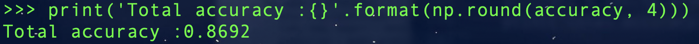
|
The accuracy is 0.87, that's very good, but to be more certain, let's classify some random variable lightcurves. The photometry for 91 OGLE II variable stars can be :download:`downloaded here <variables.zip>`. 

.. code-block:: python

   path = 'variables/'
   filenames = [file for file in os.listdir(path) if '.dat' in file]

   predictions = []

   for name in filenames:
      data = np.loadtxt(path+name)
      time, mag, magerr = data[:,0], data[:,1], data[:,2]
      prediction = model.predict(time, mag, magerr, convert=True, zp=22, apply_weights=True)
      predictions.append(prediction[np.argmax(prediction[:,1])][0])

   predictions = np.array(predictions)
   false_alert = len(np.argwhere(predictions == 3))/len(predictions)
   print('False alert rate: {}'.format(np.round(false_alert, 4)))

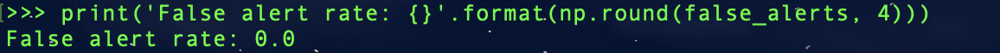
|
A false-positive rate of ~0.13 is very high, upon visual inspection we can see there are two issues with this data: low cadence and high noise. Our engine is only as accurate as our training set, thus **it is important to remember that the accuracy of the classifier depends on the accuracy of the training set**. Tuning the parameters carefully when creating the training data is important, as is the need for a large sample of real data when available. If the parameters of our simulations and the true events reside within the same parameter space, then our simulations will be characteristic of what would be new, unseen data. Poor simulations will yield poor classification results!

Example: OGLE IV
==================

This excercise makes use of OGLE IV data (see: `Udalski et al 2015 <http://acta.astrouw.edu.pl/Vol65/n1/pdf/pap_65_1_1.pdf>`_).

The lightcurves for 1000 OGLE IV microlensing events can be :download:`downloaded here <OGLE_IV.zip>`. This folder contains additional directories containing real OGLE IV lightcurves of cataclysmic variables (CV), long-period variables (LPV), and RRLyrae variables (RRLYR). In this example we will train a classifier using these real lightcurves, after which we will generate a simulated training set and compare the performance of both models.

First we will generate a training set with these real lightcurves (four classes total):

.. code-block:: python
   
   from MicroLIA import training_set

   path = 'OGLE_IV/'

   # This will create a training set, the class names are the folder names
   data_x, data_y = training_set.load_all(path=path, convert=True, zp=22, filename='OGLE_IV_REAL_LC', apply_weights=True, save_file=True)

Next we will create an optimal classifier using XGBoost:

.. code-block:: python
   
   from MicroLIA import ensemble_model

   model = ensemble_model.Classifier(data_x, data_y, clf='xgb', impute=True, optimize=True, n_iter=100, boruta_trials=1000)
   model.create()
   model.save(dirname='OGLE_IV_REAL')

We can now visualize the performance. Since XGBoost requires numerical class labels, we will create a y_labels list:

.. code-block:: python
   
   y_labels = []
   for label in model.data_y:
      if label == 0:
         y_labels.append('CV')
      elif label == 1:
         y_labels.append('LPV')
      elif label == 2:
         y_labels.append('ML')
      elif label == 3:
         y_labels.append('RRLYR')

   model.plot_conf_matrix(y_labels, savefig=True)
   model.plot_roc_curve(savefig=True)

   model.plot_tsne(y_labels, savefig=True)
   model.plot_feature_opt(feat_names='default', top=20, include_other=True, include_shadow=True, include_rejected=False, flip_axes=False, save_data=True, savefig=True)

   model.plot_hyper_opt(xlim=(1,100), ylim=(0.85,0.95), xlog=True, savefig=True)
   model.save_hyper_importance()
   model.plot_hyper_param_importance(plot_time=True, savefig=True)

Example: COSMOS
========

In addition to an the ensemble model module, MicroLIA supports image classification using Convolutional Neural Networks (CNNs). 

Model Creation
-----------

The multi-band data for 20 lens candidates from the COSMOS dataset can be :download:`downloaded here <lenses.npy>`.

An accompanying set of 500 images to be used for the negative class can be :download:`downloaded here <other.npy>`.

.. code-block:: python

   import numpy as np

   lenses = np.load('lenses.npy')
   other = np.load('other.npy')

The loaded arrays are 4-dimensional as per CNN convention: (num_images, img_width, img_height, img_num_channels). Note that the image size is 100x100 pixels, which is typically too large in the context of astrophysical filtering. The images are intentionally saved to be larger than ideal, so that if the data is oversampled via image augmentation techniques, the distorted, outer boundaries of the augmented image can be cropped out. To generate the classifier, initialize the ``Classifier`` class from the `cnn_model <https://microlia.readthedocs.io/en/latest/autoapi/MicroLIA/cnn_model/index.html>`_  module -- note the argument ``img_num_channels``, which should be set to be the number of channels in the data (3 filters for this example -- gri).

The data is background subtracted but not normalized, which is especially important for deep-learning as the range of pixel values will directly impact the model's ability to learn, we must set our normalization parameters accordingly, which will be used to apply min-max normalization:

.. code-block:: python

   from pyBIA import cnn_model 

   model = cnn_model.Classifier(lenses, other, img_num_channels=3, normalize=True, min_pixel=0, max_pixel=[100,100,100])

Note that each class is input individually, as they will be labeled 1 (positive) and 0 (negative), accordingly. In this example the ``max_pixel`` argument must be a list, containing one value per each band, as ordered in final axis of the 4-dimensional input array. In this example, the maximum pixel to min-max normalize by is set to 100 for all three channels -- therefore any pixels less than 0 will be set to 0, and any greater than 100 will be set to 100 -- after which the normalization will set the pixels to be between 0 and 1. **If your data is not normalized the gradient during backpropagation will likely explode or vanish!**

Currently, MicroLIA supports the implementation of two popular CNN architectures: AlexNet, and VGG16. These are controlled by the ``clf`` attribute, which defaults to 'alexnet'. To create a classifier using the AlexNet architecture, set the ``clf`` accordingly and call the ``create`` method:

.. code-block:: python

   model.clf = 'alexnet'
   model.create()

By default, the ``verbose`` attribute is set to 0 following the Keras convention, but this can be set to 1 to visualize the model's performance as it trains, epoch-per-epoch. The ``epochs`` attribute controls the total training epochs, which is set to 25 by default. To input validation data, set the ``val_positive`` and/or the ``val_negative`` attributes. To configure early-stopping criteria, the ``patience`` attribute can be set to a non-zero integer. This parameter will determine the number of epochs to stop the training at if there there is no training improvement, which would be indicative of over/under fitting behavior.

Our CNN pipeline supports three distinct tracking metrics, configured via the ``metric`` attribute: ``binary_accuracy``, ``loss``, and ``f1_score``, as well as the validation equivalents (e``val_binary_accuracy``, ``val_loss``, and ``val_f1_score``). 

Note that the ``Classifier`` does not support weighted loss functions, which are especially useful when the classes are imbalanced, as in this particular example. While data augmentation techniques are recommended in this scenario, if you wish to keep the training classes imbalanced, a weighted loss function can be applied by calling the CNN model functions directly,

.. code-block:: python

   model, history = cnn_model.AlexNet(lenses, other, img_num_channels=3, loss='weighted_binary_crossentropy', normalize=False, weight=2.0)

where the ``weight`` argument is a scalar factor that will control the relative weight of the positive class. When ``weight`` is greater than 1, for example, the ``loss`` function will assign more importance to the positive class, and vice versa (although in practice the positive class is the imbalanced one in binary classification problems, so it should not be less than 1). Note that setting ``weight`` equal to 1 is equivalent to using the standard binary cross-entropy loss function. Calling the models directly allows for maximum flexibility, as every argument is available for tuning including learning parameters, optional model callbacks and model-specific architecture arguments. For a full overview of the configurable model parameters, refer to the model-specific API documentation. 

Data Augmentation
-----------

In this example, we suffer from major class-imbalance as we have only 20 positive lenses and 500 negative others (1:25 imbalance). The example below demonstrates how to apply image augmentation techniques to create new synthetic images.

The ``Classifier`` class allows you to augment your positive and/or negative data by using the following methods:

.. code-block:: python

   model.augment_positive()
   model.augment_negative()

Running these methods automatically updates the ``positive_class`` and ``negative_class`` accordingly, but as no arguments were provided, the classes will remain unchanged. The number of augmentations to perform per individual sample is determined by the ``batch`` argument (1 by default). The current API supports the following variety of augmentation routines, which must be set directly when calling the ``augment_positive`` or ``augment_negative`` methods, all disabled by default:

-  ``width_shift`` (int): The max pixel shift allowed in either horizontal direction. If set to zero no horizontal shifts will be performed. Defaults to 0 pixels.

-  ``height_shift`` (int): The max pixel shift allowed in either vertical direction. If set to zero no vertical shifts will be performed. Defaults to 0 pixels.

-  ``horizontal`` (bool): If False no horizontal flips are allowed. Defaults to False.

-  ``vertical** (bool): If False no random vertical reflections are allowed. Defaults to False.

-  ``rotation`` (int): If False no random 0-360 rotation is allowed. Defaults to False.

-  ``fill`` (str): This is the treatment for data outside the boundaries after roration and shifts. Default is set to 'nearest' which repeats the closest pixel values. Can be set to: {"constant", "nearest", "reflect", "wrap"}.

-  ``image_size`` (int, bool): The length/width of the cropped image. This can be used to remove anomalies caused by the fill (defaults to 50). This can also be set to None in which case the image in its original size is returned.

-  ``mask_size`` (int): The size of the cutout mask. Defaults to None to disable random cutouts.

-  ``num_masks** (int): Number of masks to apply to each image. Defaults to None, must be an integer if mask_size is used as this designates how many masks of that size to randomly place in the image.

-  ``blend_multiplier`` (float): Sets the amount of synthetic images to make via image blending. Must be a ratio greater than or equal to 1. If set to 1, the data will be replaced with randomly blended images, if set to 1.5, it will increase the training set by 50% with blended images, and so forth. Deafults to 0 which disables this feature.
   
-  ``blending_func`` (str): The blending function to use. Options are 'mean', 'max', 'min', and 'random'. Only used when blend_multiplier >= 1. Defaults to 'mean'.
   
-  ``num_images_to_blend`` (int): The number of images to randomly select for blending. Only used when blend_multiplier >= 1. Defaults to 2.
   
-  ``zoom_range`` (tuple): Tuple of floats (min_zoom, max_zoom) specifying the range of zoom in/out values. If set to (0.9, 1.1), for example, the zoom will be randomly chosen between 90% to 110% the original image size, note that the image size thus increases if the randomly selected zoom is greater than 1, therefore it is recommended to also input an appropriate image_size. Defaults to None, which disables this procedure.
   
-  ``skew_angle`` (float): The maximum absolute value of the skew angle, in degrees. This is the maximum because the actual angle to skew by will be chosen from a uniform distribution between the negative and positive skew_angle values. Defaults to 0, which disables this feature. Using this feature is not recommended!

Rotating, skewing, and flipping images can make the training model more robust to variations in the orientation and perspective of the input images. Likewise, shifting left/right and up/down will help make the model translation invariant and thus robust to the position of the object of interest within the image. These are the recommended methods to try at first, as other techniques such as blending and applying random mask cutouts may alter the classes too dramatically.

Image blending can help to generate new samples through the combination of different images using a variety of blending criteria. Note that by default two random images will be blended together to create one synthetic sample, and since this procedure is applied post-batch creation, the same unique sample may be randomly blended, which could be problematic if the configured augmentation parameters do not generate a sufficiently varied training class. Random cutouts can help increase the diversity of the training set and reduce overfitting, as applying this technique prevents the training model from relying too heavily on specific features of the image, thus encouraging the model to learn more general image attributes. **As noted above, applying these techniques may result in an unstable classification engine as you may end up generating a synthetic class with image features that are too different, use with caution!**

These techniques, when enabled, are applied in the following order:

**(1)** Random shift + flip + rotation: Generates ``batch`` number of images.

**(2)** Random zoom in or out.

**(3)** If ``image_size`` is set, the image is resized so as to crop the distorted boundary.
    
**(4)** Random image skewness is applied, with the ``skew_angle`` controlling the maximum angle, in degrees, to distort the image from its original position.

**(5)** The batch size is now increased by a factor of ``blend_multiplier``, where each unique sample is generated by randomly merging ``num_images_to_blend`` together according to the blending function ``blend_function``. As per the random nature, an original sample may be blended together at this stage, but with enough variation this may not be a problem.

**(6)** Circular cutouts of size ``mask_size`` are randomly placed in the image, whereby the cutouts replace the pixel values with zeroes. Note that as per the random nature of the routine, if ``num_masks`` is greater than 1, overlap between each cutout may occur, depending on the corresponding image size to ``mask_size`` ratio.

Note that MicroLIA's data augmentation routine is for offline data augmentation. Online augmentation may be preferred in certain cases as that exposes the training model to significantly more varied samples. If multiple image filters are being used, the data augmentation procedure will save the seeds from the augmentation of the first filter, after which the seeds will be applied to the remaining filters, thus ensuring the same augmentation procedure is applied across all channels.

For this example, we will augment each unique sample in the ``positive_class`` 25 times by setting the ``batch`` parameter, with each augmented sample generated by randomizing the enabled procedures:

.. code-block:: python
   
   batch = 25; image_size = 67
   width_shift = height_shift = 10
   vertical = horizontal = rotation = True 
   zoom_range = (0.9, 1.1)
   mask_size = num_masks = 5
   
   model.augment_positive(batch=10, width_shift=width_shift, height_shift=height_shift, vertical=vertical, horizontal=horizontal, rotation=rotation, zoom_range=zoom_range, image_size=image_size, mask_size=mask_size, num_masks=num_masks)

The ``positive_class`` will now contain 500 images so as to match our ``negative_class``. Alternatively, we could have set ``batch`` to 10, and enabled the ``blend_multiplier`` option with a value of 2.5, to bring the final sample to 500 (20 original images times 10 augmentations times a 2.5 blending multiplier). When applying mask cutouts, it is avised to apply similar cutouts to the ``negative_class`` so as to prevent the model from associating random cutouts with the positive class:

.. code-block:: python

   model.augment_negative(mask_size=mask_size, num_masks=num_masks, image_size=image_size)

Note that the ``image_size`` paramter was set to 67 when augmenting the ``positive_class``, so even if you wish to leave the other training class the same, you would still have to resize your data by running the ``augment_negative`` method with only the ``image_size`` argument. The ``_plot_positive`` and ``_plot_negative`` class attributes can be used for quick visualization.

.. code-block:: python

   model._plot_positive()
   model._plot_negative()

If an image appears dark, run the methods again but manually set the ``vmin`` and ``vmax`` arguments, as by the default these limits are derived using a robust scaling. To re-do the augmentations, simply reset the positive and negative class attributes and try again:

.. code-block:: python

   model.positive_class = lenses 
   model.augment_positive(blend_multiplier=50, num_images_to_blend=3, blending_func='mean', image_size=image_size)

   model.negative_class = other 
   model.augment_negative(blend_multiplier=1, num_images_to_blend=3, blending_func='mean', image_size=image_size)

In this attempt we apply only the blending routine, note that blend_multiplier is set to 1 for the negative class, so as to implement blending for the other class while keeping the original class size the same. When the classes are ready for training, simply call the ``create`` method. 

No current options are available for augmenting the validation data, but this can be accomplished manually via the `data_augmentation <https://microlia.readthedocs.io/en/latest/autoapi/MicroLIA/data_augmentation/index.html#MicroLIA.data_augmentation.augmentation>`_ module.

Optimization
-----------

If you know what augmentation procedures are appropriate for your dataset, but don't know what specfic thresholds to use, you can configure the ``Classifier`` class to identify the optimal augmentations parameter to apply to your dataset. To enable optimization, set ``optimize`` to ``True``. MicroLIA supports two optimization options, one is ``opt_aug``, which when set to ``True``, will optimize the augmentation options that have been enabled. The class attributes that control the augmentation optimization include:
   
-  ``batch_min`` (int): The minimum number of augmentations to perform per image on the positive class, only applicable if opt_aug=True. Defaults to 2.

-  ``batch_max`` (int): The maximum number of augmentations to perform per image on the positive class, only applicable if opt_aug=True. Defaults to 25.

-  ``batch_other`` (int): The number of augmentations to perform to the other class, presumed to be the majority class. Defaults to 1. This is done to ensure augmentation techniques are applied consistently across both classes.        

-  ``image_size_min`` (int): The minimum image size to assess, only applicable if opt_aug=True. Defaults to 50.

-  ``image_size_max`` (int): The maximum image size to assess, only applicable if opt_aug=True. Defaults to 100.

-  ``opt_max_min_pix`` (int, optional): The minimum max pixel value to use when tuning the normalization procedure, only applicable if opt_aug=True. Defaults to None.

-  ``opt_max_max_pix`` (int, optional): The maximum max pixel value to use when tuning the normalization procedure, only applicable if opt_aug=True. Defaults to None.

-  ``shift`` (int): The max allowed vertical/horizontal shifts to use during the data augmentation routine, only applicable if opt_aug=True. Defaults to 10 pixels.

-  ``mask_size`` (int, optional): If enabled, this will set the pixel length of a square cutout, to be randomly placed somewhere in the augmented image. This cutout will replace the image values with 0, therefore serving as a regularizear. Only applicable if opt_aug=True. Defaults to None.

-  ``num_masks`` (int, optional): The number of masks to create, to be used alongside the mask_size parameter. If this is set to a value greater than one, overlap may occur. 

-  ``blend_max`` (float): A float greater than 1.1, corresponding to the increase in the minority class after the blending augmentations, to be used if optimizing with opt_aug=True, then this parameter will be tuned and will be used as the maximum increase to accept. For example, if opt_aug=True and blend_max=5, then the optimization will return an optimal value between 1 and 5. If set to 1, then the blending procedure is applied but the minority class size remains same. If set to 5, then the minority class will be increased 500% via the blening routine. Defaults to 0 which disables this feature. To enable when opt_aug=True, set to greater than or equal to 1.1 (a minimum maximum of 10% increase is required), which would thus try different values for this during the optimization between 1 and 1.1.

-  ``blend_other`` (float): Must be greater than or equal to 1. Can be set to zero to avoid applying augmentation to the majority class. It is recommended to enable this if applying blending and/or cutouts so as to avoid training a classifier that associates these features with the positive class only.
   
-  ``zoom_range`` (tuple): This sets the allowed zoom in/out range. This is not optimized, and must be set carefully according to the data being used. During the optimization, random zooms will occur according to this designated range. Can be set to zero to disable.

The second optimization routine is enabled by setting ``opt_model`` to True. This will optimize the 

.. code-block:: python

   model._plot_positive(index=0, channel=0)

This will plot the first object in the ``positive_class`` array, with the filter to displayed designated by the ``channel`` argument. If set to 'all', the figure will combine all filters to form a colorized image. 

