.. _Examples:

Example: OGLE II
==================

This example makes use of OGLE II data, (see: `Udalski et al 1997 <https://ui.adsabs.harvard.edu/abs/1997AcA....47..319U/abstract>`_).

The lightcurves for 214 OGLE II microlensing events can be :download:`downloaded here <OGLE_II.zip>`. 

Each file contains three space-delimited columns: time, mag, magerr

We will train MicroLIA for OGLE II microlensing detection, and record how many of these 214 events we can successfully recover using a training set of simulated lightcurves. 

Training Set
-----------
Adaptive cadence is extremely important as this allows MicroLIA to detect microlensing events even if the survey footprint is sparse. In this example we will train the classifier using OGLE II cadence, which we can take to be the timestamps of these 214 lightcurves. To begin the training, we need to append the time array of each lightcurve to a list:

.. code-block:: python

   import os
   import numpy as np

   path = 'OGLE_II/' 
   filenames = [file for file in os.listdir(path) if '.dat' in file]

   timestamps = []

   for name in filenames:
      time = np.loadtxt(path+name)[:,0]
      timestamps.append(time)

This timestamps list will be used to simulate the training data, as each time a lightcurve is simulated a timestamp from the list will be random selected. In this example, we will set the ``min_mag`` of the survey to be 15, and the ``max_mag`` to be 20. We will also set ``n_class`` to be 100, which corresponds to the size of each training class. The ``training_set`` module simulates the lightcurves:

.. code-block:: python

   from MicroLIA import training_set

   data_x, data_y = training_set.create(timestamps, min_mag=15, max_mag=20, n_class=100)

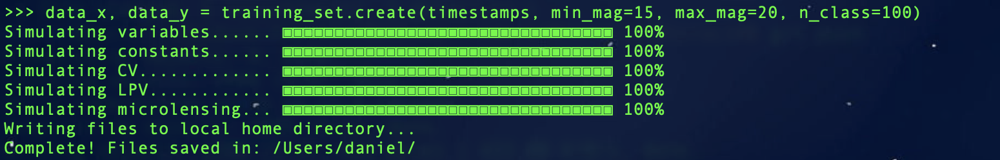
|
There are a number of other parameters we can control when creating the training set, including the exposure time and zeropoint of the survey telescope and whether or not to apply the photometric errors to calculate the statistical metrics (``apply_weights``). Setting these parameters carefully will ensure that our training set matches what will be observed. **To be more accurate we will set these optional parameters and simulate 100 objects per class, in addition to including a first-order noise model using the rms and median mag of our OGLE II data.**

.. code-block:: python

   from MicroLIA import training_set, noise_models

   rms_mag, median_mag = [], []

   for name in filenames:
      mag = np.loadtxt(path+name)[:,1]
      rms = 0.5*np.abs(np.percentile(mag,84) - np.percentile(mag,16))
      rms_mag.append(rms); median_mag.append(np.median(mag))

   ogle_noise = noise_models.create_noise(median_mag, rms_mag)

   data_x, data_y = training_set.create(timestamps, min_mag=np.min(median_mag), max_mag=np.max(median_mag), noise=ogle_noise, zp=22, exptime=30, n_class=100, apply_weights=True)

The simulated lightcurves will be saved by default in a 'lightcurves.fits' file, organized by class and ID. This file once loaded can be used to plot the simulated lightcurves using the `plot <https://microlia.readthedocs.io/en/latest/autoapi/MicroLIA/training_set/index.html#MicroLIA.training_set.plot>`_ function. A file called 'all_features.txt' will be saved as well, containing the statistical metrics of each lightcurve, with the first column containing the class of each simulated object (``str``), and the second columns the corresponding unique ID (``int``). 

**As of version 2.0, a pandas dataframe will automatically be saved for easier access to the individual metrics, titled 'MicroLIA_Training_Set.csv', which can be loaded post-processing as follows:**

.. code-block:: python
   
   from pandas import read_csv

   csv_file = read_csv('MicroLIA_Training_Set.csv')

   from MicroLIA import ensemble_model
   
   model = ensemble_model.Classifier(training_set=csv_file)

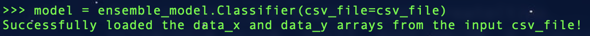
|
Even though these files are saved by default, the `create <https://microlia.readthedocs.io/en/latest/autoapi/MicroLIA/training_set/index.html#MicroLIA.training_set.create>`_ function will also return two outputs: the statistical metrics (``data_x``), and the corresponding class labels (``data_y``), which can always be loaded directly from the saved 'all_features.txt' file. 

There are additional parameters that can be called when creating the training set, including arguments that control the "quality" of the simulated microlensing and cataclysmic variable lightcurves. These parameters control the number of measurements that must be within the observed signals -- this is especially important to tune if the cadence of the survey is sparse, as per the random nature of the simulations, some signals may contain too few points within the transient event to be properly detected and classified. 

If poor lightcurves are simulated in which the event is not adequately captured, the classifier will be heavily biased, as these lightcurves may not be representative of the actual class. This discrepancy between the assigned class label and the characteristics of the simulated signal will impact the generalization and thus the performance of the classifier, please refer to the  `API documentation <https://microlia.readthedocs.io/en/latest/autoapi/MicroLIA/training_set/index.html>`_ for more information on tuning these parameters.

Ensemble Classification Engine
-----------
We will create our ensemble machine learning model using the statistical features of the lightcurves, which are saved in the 'all_features.txt' file when the training set was genereated. The first column is the lightcurve class, and therefore will be loaded as our training labels. The second column is the unique ID of the simulated lightcurve, which will be ignored. 

In this example we will load this file to re-generate the data_x and data_y arrays, although note above that the training set routine returns ``data_x`` and ``data_y`` as outputs, and more conveniently, the ``training_set`` can be input instead (and if need-be the statistics can always be re-computed using the `extract_features <https://microlia.readthedocs.io/en/latest/autoapi/MicroLIA/extract_features/index.html>`_) function.

.. code-block:: python
   
   from pathlib import Path

   data = np.loadtxt(str(Path.home()) + '/all_features.txt', dtype=str, comments='#') #By default the file is saved in the home directory

   data_x = data[:,2:].astype('float')
   data_y = data[:,0]
   
With the training data loaded we can create the machine learning engine with MicroLIA's `models <https://microlia.readthedocs.io/en/latest/autoapi/MicroLIA/models/index.html>`_ module. When training the model three optimization procedures can be enabled:

-  Missing values (NaN) can be imputed using by setting ``impute`` to True. By default this applies the `sklearn implementation of the k Nearest Neighbors imputation algorithm <https://scikit-learn.org/stable/modules/generated/sklearn.impute.KNNImputer.html>`_. The imputer will be saved as a class attribute so that it can be applied to transform new, unseen data, serving as a means to address the issue of missing data values. 

-  The features that contain useful information can be selected by setting ``optimize`` to True and a non-zero ``boruta_trials`` argument. This will apply `BorutaShap <https://zenodo.org/record/4247618>`_, a procedure based off of the Boruta algorithm developed by `Kursa and Rudnicki 2011 <https://arxiv.org/pdf/1106.5112.pdf>`_. BorutaShap improves upon the original algorithm by coupling its probabilistic approach to feature selection with `Shapley Values <https://christophm.github.io/interpretable-ml-book/shapley.html>`_. While bagging algorithms like the Random Forest can be robust to irrelevant features, we find that it in practice it is important to compute only the relevant features for the task at hand.

-  Finally, the model hyperparameters will be optimized if ``optimize`` is True and ``n_iter`` is a non-zero argument, using the hyperparameter optimization software `Optuna <https://optuna.org/>`_, developed by `Akiba et al 2019 <https://arxiv.org/abs/1907.10902>`_. The default sampler Optuna employs is the Tree Parzen Estimator, a Bayesian optimization approach that effectively reduces the error by narrowing the search space according to the performance of previous iterations, therefore in principle it is best to increase the ``n_iter`` parameter.

Note that these three options are disabled by default, therefore to create and optimize an XGBoost classifier using the above procedures we can create the model as such:

.. code-block:: python

   from MicroLIA import ensemble_model

   model = ensemble_model.Classifier(data_x, data_y, clf='xgb', impute=True, optimize=True, n_iter=25, boruta_trials=25)
   model.create()

.. figure:: _static/optimized_ensemble_model_1.png
    :align: center
|
To avoid overfitting during the optimization procedure, 10-fold cross-validation is enabled by default to assess performance at the end of each trial, therefore the hyperparameter optimization can take a long time depending on the size of the training set and the algorithm being optimized. This setting can be tuned using the ``opt_cv`` argument, which can be set to 1 to do only one split and avoid cross-validation altogether.

The ``ensemble_model`` module currently supports three machine learning algorithms: Random Forest, Extreme Gradient Boosting, and Neural Network. While ``clf`` = 'rf' for Random Forest is the default input, we can also set this to 'xgb':

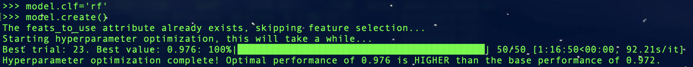
|
We can also set the ``clf`` parameter to 'nn' for neural nework; since the neural network implementation requires more tuning to properly identify the optimal combination of layers and neurons, it is recommended to set ``n_iter`` to at least 100 everytime you optimize this engine:

Note that there is a ``boruta_trials`` argument which sets the number of iterations to perform when calculating feature importance, and is activated when ``optimize`` is set to True. If ``boruta_trials`` is set to 0, the feature selection procedure will be skipped and all features will be used. As shown in the picture above, even if ``boruta_trials`` is enabled, the feature selection will be skipped if the ``feats_to_use`` attribute has been set, as happened after the first XGBoost model was created. 

For details on how to set the classifier and the accompanying optimization parameters, refer to the `ensemble_model <https://microlia.readthedocs.io/en/latest/autoapi/MicroLIA/models/index.html#MicroLIA.models.create>`_ API documentation.

Saving & Loading Models
-----------
Once a model is created we can save the model and the optimziation parameters using the save class method, which saves the model, imputer, feats_to_use, optimization_results, best_params, and feature_history, when applicable. Unless a ``path`` argument is specified when saving, the files are saved to a folder in the local home directory; by design this folder will always be named 'MicroLIA_ensemble_model'.

.. code-block:: python

   model.save(dirname='test_model', path=None)

|
In the above example, `test_model` folder will be created by the program and hence should not already exist. Within this directory you will find the 'MicroLIA_ensemble_model' folder. To load the model we can do the following:

.. code-block:: python
   
   import pandas as pd 

   # Load the csv file that was saved after creating the training data
   csv = pd.read_csv('MicroLIA_Training_Set.csv')

   model = ensemble_model.Classifier(clf='xgb', impute=True, training_set=csv)
   model.load(path='test_model')

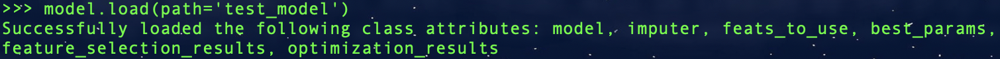
|
Note that by default the load method will look for the saved 'MicroLIA_ensemble_model' folder in local home directory; since we set the ``dirname`` argument to 'test_folder', this will serve as the ``path`` when loading the model. The loaded attributes can then be used to predict unseen samples and/or display any of the visualization methods described below. **Unlike the CNN module, the ensemble module does not save all the pre-configured attributes, therefore remember to properly set the impute and clf arguments when loading generated models!**

Model Visualizations
-----------
To visualize the classification accuracies we can create a confusion matrix. By default, the matrix displays the mean accuracy after 10-fold cross-validation, which can controlled with the ``k_fold`` parameter. For details regarding the confusion matrix generation, refer to the `method documentation <https://microlia.readthedocs.io/en/latest/autoapi/MicroLIA/ensemble_model/index.html#MicroLIA.ensemble_model.Classifier.plot_conf_matrix>`_. Note that all the visualization options shown below include a ``savefig`` parameter which will not display the plot and will instead save the figure to the local home directory (False by default).

.. code-block:: python

   model.plot_conf_matrix(k_fold=10)

.. figure:: _static/Ensemble_Confusion_Matrix_1.png
    :align: center
|
When using the XGBoost classifier, the class labels are automatically converted to numerical representations, but the string labels are saved when the class is instantiated and will show up when plotting. We can also plot a `Receiver Operating Characteristic Curve <https://microlia.readthedocs.io/en/latest/autoapi/MicroLIA/ensemble_model/index.html#MicroLIA.ensemble_model.Classifier.plot_roc_curve>`_, which will always show the training labels required when fitting the model, thus numerical for XGBoost:

.. code-block:: python

   model.plot_roc_curve(k_fold=10)

.. figure:: _static/Ensemble_ROC_Curve_1.png
    :align: center
|
We can visualize the training feature space using a two-dimensional `tSNE projection <https://microlia.readthedocs.io/en/latest/autoapi/MicroLIA/ensemble_model/index.html#MicroLIA.ensemble_model.Classifier.plot_tsne>`_. To properly visualize the feature space given we will ensure that ``norm`` is set to True so as to min-max normalize all the features for proper scaling and comparison:

.. code-block:: python

   model.plot_tsne(norm=True)

.. figure:: _static/tSNE_Projection_1.png
    :align: center
|
We can also plot the `feature selection history <https://microlia.readthedocs.io/en/latest/autoapi/MicroLIA/ensemble_model/index.html#MicroLIA.ensemble_model.Classifier.plot_feature_opt>`_ as output by the feature optimization routine, which by default will associate the feature names with the index at which they are present in the ``data_x`` array; unless the ``training_set``  argument was input when creating the model, in which case the column names will be used to represent the features. To override this at any point, we can input a custom ``feat_names`` list containing the custom names, especially helpful for publication purposes in which we may wish to properly format the feature names and/or include special characters using LaTex format. 

Additionally, we can set ``feat_names`` argument to 'default', which is only applicable if the features in the input `data_x` array were calculated using MicroLIA's `extract_features <https://microlia.readthedocs.io/en/latest/autoapi/MicroLIA/extract_features/index.html#MicroLIA.extract_features.extract_all>`_. module (thus not applicable if using a custom data_x array or if the training data was generated elsewhere).

.. code-block:: python

   model.plot_feature_opt(feat_names='default', top=10, include_other=True, include_shadow=True, include_rejected=False, flip_axes=True)

.. figure:: _static/Feature_Importance_1.png
    :align: center
|
The 'Deriv-' flag that precedes some of the feature names indicates that the metric was computed in the lightcurve's derivative space. We can plot more than just the top 10, and can even un-flip the axes for better visualization:

.. code-block:: python

   model.plot_feature_opt(feat_names='default', top=30, include_other=True, include_shadow=True, include_rejected=False, flip_axes=False)

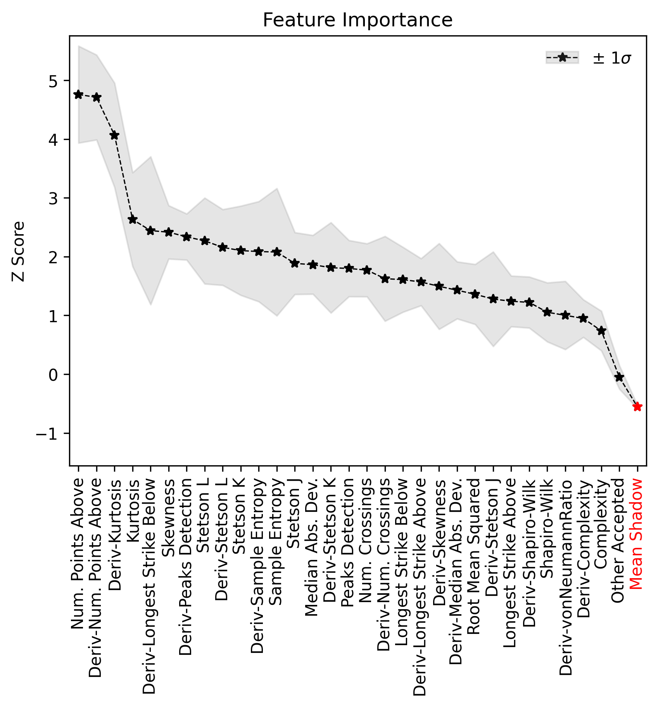
|
In addition to the feature selection history, the `hyperparameter optimization results <https://microlia.readthedocs.io/en/latest/autoapi/MicroLIA/ensemble_model/index.html#MicroLIA.ensemble_model.Classifier.plot_hyper_opt>`_, including the importance of each hyperparameter in terms of its contribution to the engine's accuracy and training time, can be visualized using the following methods:

.. code-block:: python

   #Plot the hyperparameter optimization history
   model.plot_hyper_opt(xlim=(1,50), ylim=(0.92,0.98), xlog=True)

   #Need to save the importances first, must run once the first time!
   model.save_hyper_importance()

   #Plot the hyperparameter importances
   model.plot_hyper_param_importance(plot_time=True)

.. figure:: _static/Ensemble_Hyperparameter_Optimization_1.png
    :align: center
|
.. figure:: _static/Ensemble_Hyperparameter_Importance_1.png
    :align: center
|
To include the parameter space of the real OGLE II microlensing lightcurves in comparison to the simulated lightcurves, so as to deduce how representative of real data our training set is, we can manually include these statistics in the t-SNE projection. We can save the statistics of the real OGLE II lightcurves and append them to the ``data_x`` class attribute -- as for the class label, we can name these 'OGLE_ML' which will be likewise be appended to the model's ``data_y`` array. 

.. code-block:: python
   
   import os
   import numpy as np
   from MicroLIA.extract_features import extract_all

   path = 'OGLE_II/' 
   filenames = [file for file in os.listdir(path) if '.dat' in file]

   ogle_data_x, ogle_data_y = [], []

   # Save the stats of each ML lightcurve manually
   for name in filenames:
     data = np.loadtxt(path+name)
     time, mag, magerr = data[:,0], data[:,1], data[:,2]
     stats = extract_all(time, mag, magerr, convert=True, zp=22, apply_weights=True)
     ogle_data_x.append(stats); ogle_data_y.append('OGLE_ML')

   ogle_data_x, ogle_data_y = np.array(ogle_data_x), np.array(ogle_data_y)

   # Create a new model, only need to specify the training set csv
   new_model = ensemble_model.Classifier(training_set=csv)
   new_model.load('test_model')

   # Add the OGLE ML data arrays
   new_model.data_x = np.concatenate((new_model.data_x, ogle_data_x))
   new_model.data_y = np.r_[new_model.data_y, ogle_data_y]

   # Plot the t-SNE projection
   new_model.plot_tsne()

.. figure:: _static/tSNE_Projection_2.png
    :align: center
|
As expected, the simulated microlensing lightcurves (ML) overlap with the real OGLE II microlensing events (OGLE_ML). Unlike simulations, real data can be messy and difficult to properly preprocess. If you notice a lot of misclassifications, it would be because the simulations don't reflect the real data; therefore it is good to double check by comparing the high-dimensional feature space of the simulated and target lightcurves.

Model Performance
-----------
With the optimized model saved, as well as the imputer and indices of useful features to use, we can begin classifying any lightcurve using the `predict <https://microlia.readthedocs.io/en/latest/autoapi/MicroLIA/ensemble_model/index.html#MicroLIA.ensemble_model.Classifier.predict>`_ class method. Let's load the first OGLE II microlensing lightcurve and check what the prediction is:

.. code-block:: python

   data = np.loadtxt('OGLE_II/'+filenames[0])
   time, mag, magerr = data[:,0], data[:,1], data[:,2]

   prediction = model.predict(time, mag, magerr, convert=True, zp=22, apply_weights=True)

   print(prediction)
.. figure:: _static/prediction_1.png
    :align: center
|
When making predictions, the relevant statistis are computed for the input lightcurve(s) according to the feature selection, which in turn speeds up the computation as not all metrics have to be calculated. Note that by default ``convert`` is set True, which will convert the magnitude input to flux values, therefore we must set the appropriate zeropoint argument. This ``zp`` must match whatever value was used when creating the training set, in this example ``zp`` = 22 as per the OGLE observations. Likewise, since ``apply_weights`` was enabled when the training set was generated, we must insure we compute the statistics the same way by also setting this flag when doing the predictions.

The prediction output is the label and probability prediction of each class, ordered in alphabetical/numerical order. The predicted class in this case is '1' corresponding to the 'CV' class, as the corresponding classification accuracy of this class is higher than all the others. Let's load all 214 lightcurves and check the overall prediction accuracy:

.. code-block:: python

   predictions = [] #Empty list to store only the prediction label

   for name in filenames:
      data = np.loadtxt(path+name)
      time, mag, magerr = data[:,0], data[:,1], data[:,2]
      prediction = model.predict(time, mag, magerr, convert=True, zp=22, apply_weights=True)
      predictions.append(prediction[np.argmax(prediction[:,1])][0])

   predictions = np.array(predictions)
   accuracy = len(np.argwhere(predictions == 3)) / len(predictions)
   print('Total accuracy :{}'.format(np.round(accuracy, 4)))

.. figure:: _static/accuracy_1.png
    :align: center
|
The accuracy is approximately 90%, that's very good, but to be more certain, let's classify some random variable lightcurves. The photometry for 91 OGLE II variable stars can be :download:`downloaded here <variables.zip>`. 

.. code-block:: python

   path = 'variables/'
   filenames = [file for file in os.listdir(path) if '.dat' in file]

   predictions = []

   for name in filenames:
      data = np.loadtxt(path+name)
      time, mag, magerr = data[:,0], data[:,1], data[:,2]
      prediction = model.predict(time, mag, magerr, convert=True, zp=22, apply_weights=True)
      predictions.append(prediction[np.argmax(prediction[:,1])][0])

   predictions = np.array(predictions)
   accuracy = len(np.argwhere(predictions == 4))/len(predictions)
   print('True positive rate: {}'.format(np.round(accuracy, 4)))

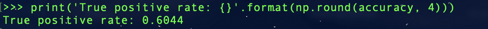
|
In the above example we check how many of these predictions come out with a label of '4' which corresponds to VARIABLE as per the alphebatical ordering, and we see that 0.6 are classified correctly. Now let's check how many of these 91 variables are classified as microlensing (label '3'):

.. code-block:: python

   false_alerts = len(np.argwhere(predictions == 3))/len(predictions)
   print('False alert rate: {}'.format(np.round(false_alerts, 4)))

.. figure:: _static/false_alerts_1.png
    :align: center
|
So no false-positives for our target class, very good! Nonetheless, **it is important to remember that the accuracy of the classifier depends on the accuracy of the training set**. Tuning the parameters carefully when creating the training data is important, as is the need for a large sample of real data when available. If the parameters of our simulations and the true events reside within the same parameter space, then our simulations will be characteristic of what would be new, unseen data. Poor simulations will yield poor classification results!

A Note on Feature Selection
-----------

Note that the `Classifier <https://microlia.readthedocs.io/en/latest/autoapi/MicroLIA/ensemble_model/index.html#MicroLIA.ensemble_model.Classifier>`_ class also takes in a ``boruta_model`` argument, which defaults to 'rf' as per the original implementation of the Boruta algorithm; this can also be set to 'xgb' to rank the features using the XGBoost implementation:

.. code-block:: python

   model.optimize = True # To enable feature and hyperparameter optimization
   model.n_iter = 0 # Skips the hyperparameter optimization
   model.feats_to_use = None # Resets the feature selection
   model.boruta_trials = 1000 
   model.boruta_model = 'xgb'
   model.create()

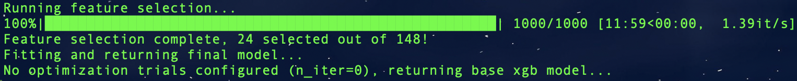
|

**In this case only 24 features were selected!** Unlike Random Forest, XGBoost determines feature importance by considering the number of times a feature is used for data splitting throughout all boosting rounds. It assesses the relative frequency of feature usage and incorporates the gain, which represents the improvement in the loss function achieved by each split. This approach results in XGBoost's feature importance scores being generally skewed, as it assigns higher importance scores to the most discriminative features.

On the other hand, Random Forest calculates feature importance by averaging the reduction in impurity across all decision trees in the ensemble. It measures the overall impurity reduction achieved by splitting data based on a specific feature. The importance scores in Random Forest are typically normalized, with higher values indicating more significant features. This algorithm tends to provide a balanced distribution of feature importance, spreading importance across multiple features. Using 'xgb' to rank the features, the optimizer yeilds the following results (note that now we are setting ``top`` to 'all' as there were only 24 features selected)

.. code-block:: python

   model.plot_feature_opt(feat_names='default', top='all', include_other=True, include_shadow=True, include_rejected=False, flip_axes=True)

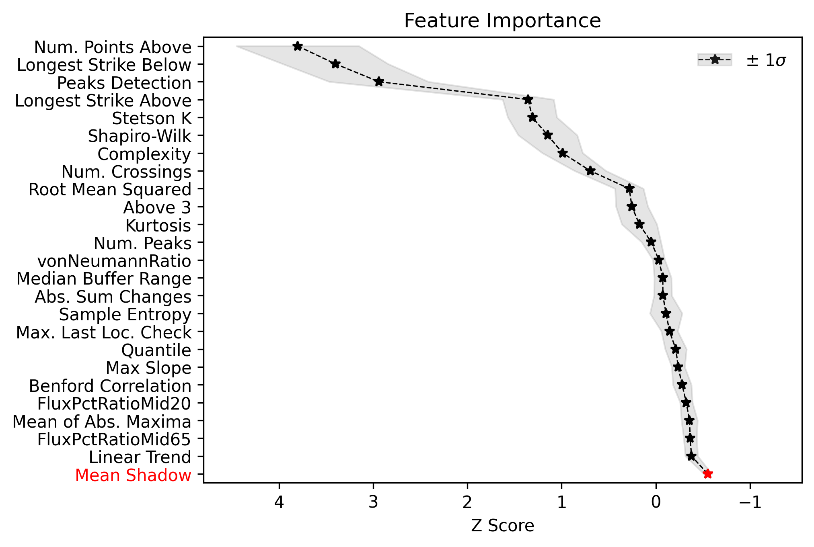
|
When running ``plot_feature_opt`` you can set the ``save_data`` parameter to True which will save a csv file showing the scores of all features including the shadows. It is recommended to run the feature selection with the default 'rf' model first. If you need to truncate the features to use further, so as to speed up the feature computation, for example, then try the 'xgb' ``boruta_model`` option, but careful validation is advised as ensemble machine learning engines tend to be robust to irrelevant features.

Example: OGLE IV
==================

This excercise makes use of OGLE IV data (see: `Udalski et al 2015 <http://acta.astrouw.edu.pl/Vol65/n1/pdf/pap_65_1_1.pdf>`_).

The lightcurves for 1000 OGLE IV microlensing events can be :download:`downloaded here <OGLE_IV.zip>`. This folder contains additional directories containing real OGLE IV lightcurves of cataclysmic variables (CV), long-period variables (LPV), and RRLyrae variables (RRLYR). In this example we will train a classifier using these real lightcurves, the training set will be created using the ``load_all`` function from the training_set module:

.. code-block:: python
   
   from MicroLIA import training_set

   path = 'OGLE_IV/'

   # This will create a training set, the class names are the folder names
   data_x, data_y = training_set.load_all(path=path, convert=True, zp=22, filename='OGLE_IV_REAL_LC', apply_weights=True, save_file=True)

Next we will create an optimal classifier using XGBoost (this model is available in the MicroLIA test folder, saved as **test_model_xgb**), using 10-fold cross-validation:

.. code-block:: python
   
   from MicroLIA import ensemble_model

   model = ensemble_model.Classifier(data_x, data_y, clf='xgb', impute=True, optimize=True, opt_cv=10, n_iter=100, boruta_trials=1000)
   model.create()
   model.save('OGLE_IV_REAL')

We can now visualize the performance:

.. code-block:: python
   
   model.plot_conf_matrix() #Applies 10-fold CV by default
   model.plot_tsne()

|
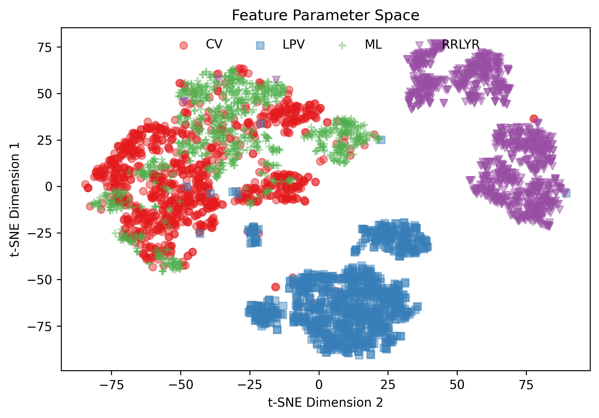
|

We can also visualize the optimization results:

.. code-block:: python

   model.plot_feature_opt(feat_names='default', top=20, flip_axes=True)
   model.plot_hyper_opt(xlim=(1,100), ylim=(0.9775,0.995), xlog=True)
   model.save_hyper_importance()
   model.plot_hyper_param_importance(plot_time=True)

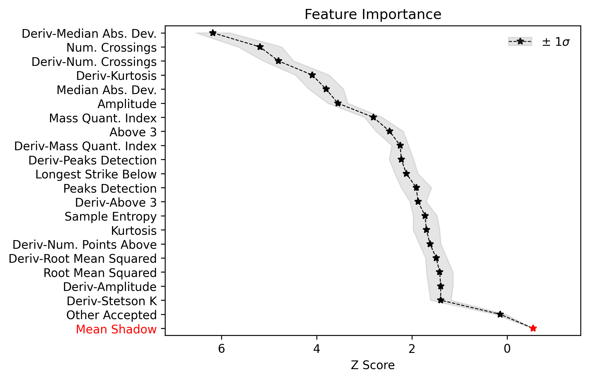
|
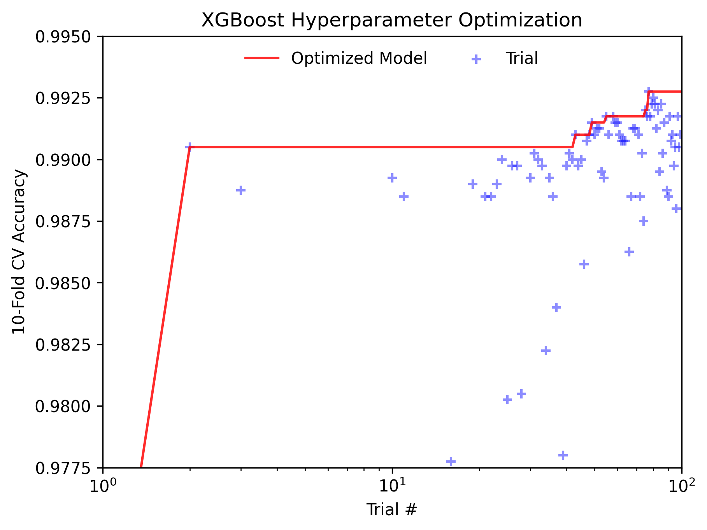
|
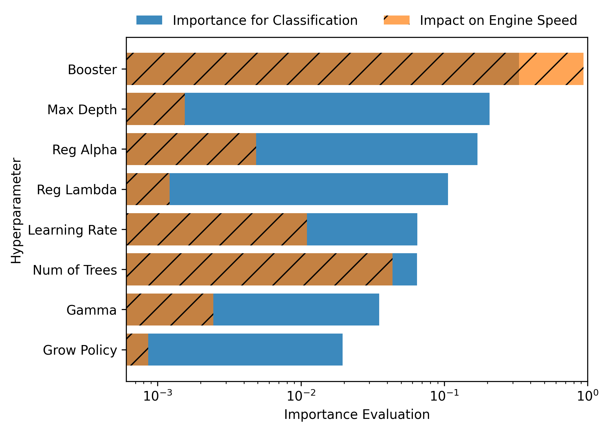
|

From the 148 statistical features computed, the feature selection routine identified 128 as useful, although as stated in the above note on feature selection, the default engine used to rank these metrics is the random forest which yields a more conservative selection. We will now change the ``boruta_model`` to XGBoost instead, and will re-optimize the model given the newly selected features:

.. code-block:: python
   
   new_model = ensemble_model.Classifier(data_x, data_y, clf='xgb', impute=True, optimize=True, opt_cv=10, n_iter=100, boruta_trials=1000, boruta_model='xgb')
   new_model.create()

We can see that this new model only requires 44 features:
   
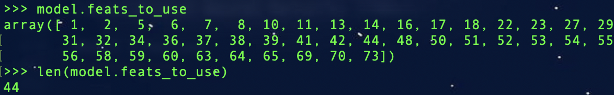
|
This new model in turn yields faster predictions as only 30\% of the total features will be computed, yet given the the corresponding confusion matrix and the truncated feature space we can see similar model results:

.. code-block:: python
   
   new_model.plot_conf_matrix() #Applies 10-fold CV by default
   new_model.plot_tsne()

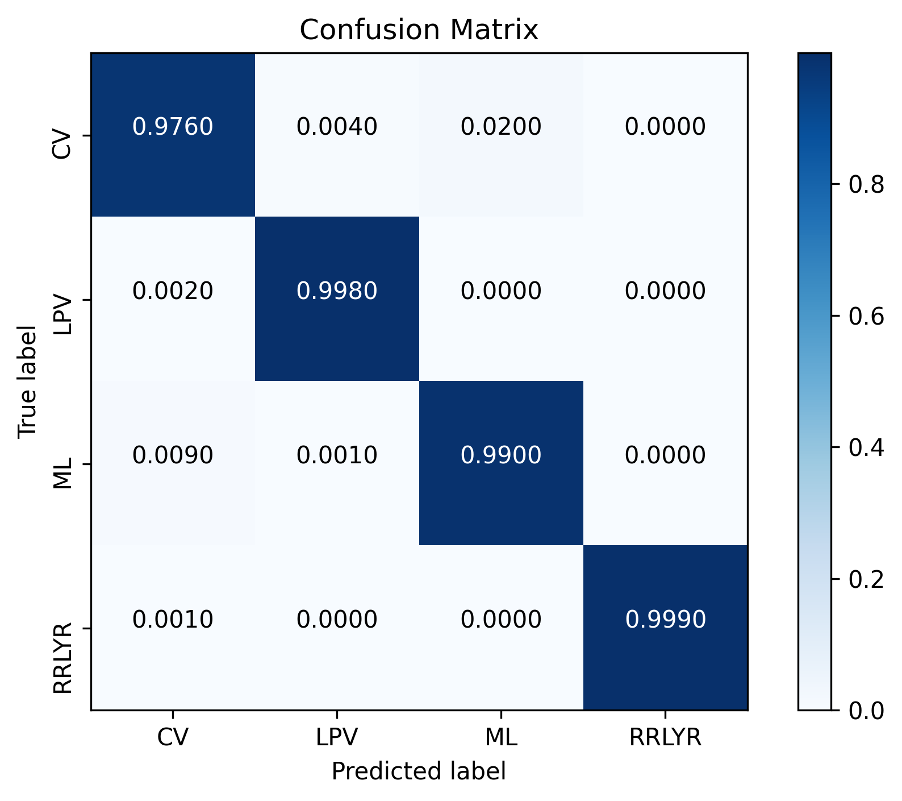
|
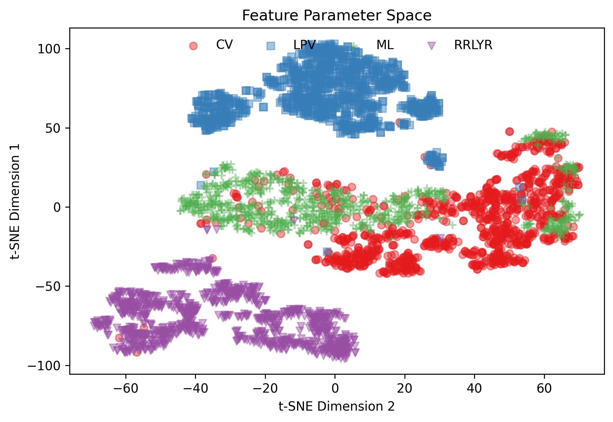
|

Therefore, we can achieve similar 10-fold CV accuracies with only these features:

.. code-block:: python
   
   model.plot_feature_opt(feat_names='default', top='all', flip_axes=False)

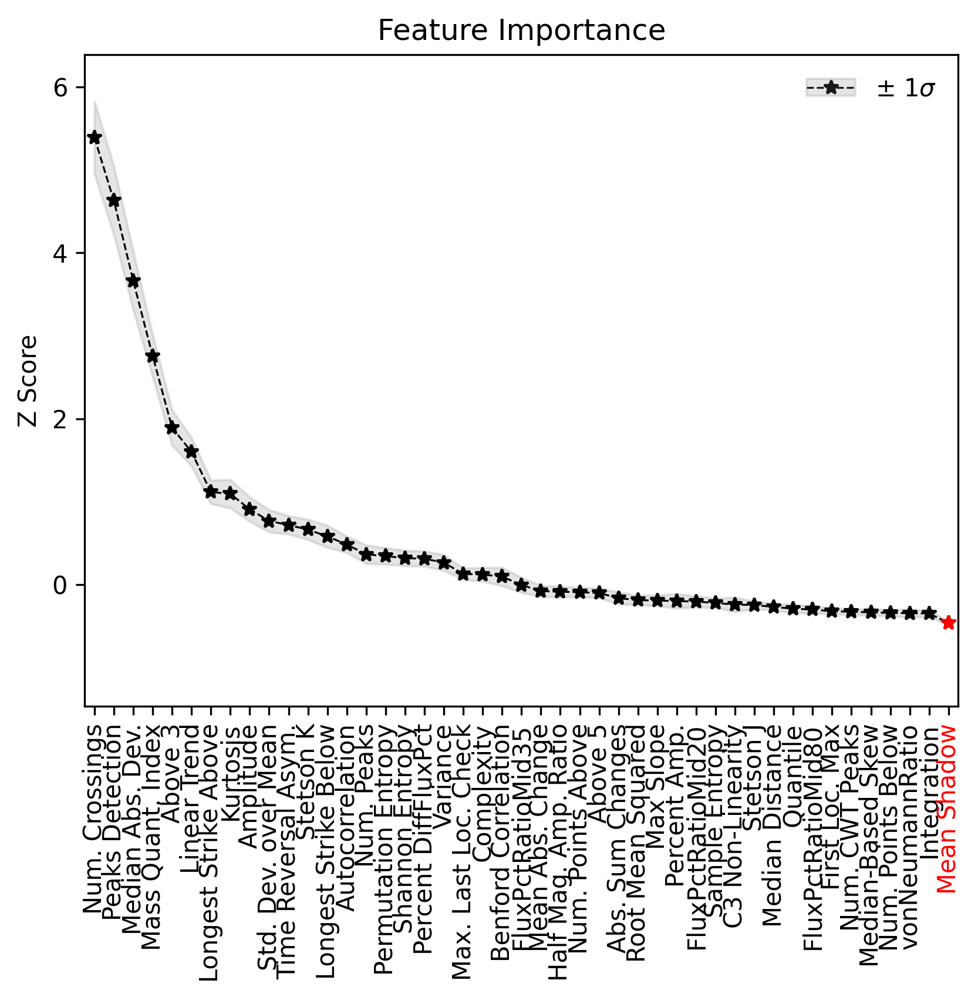
|
In practice I have found that using less features can result in different probability predictions (lower probabilities than when using the rf-based selection), so proper analysis using leave-one-out cross validation, for example, is advised.
