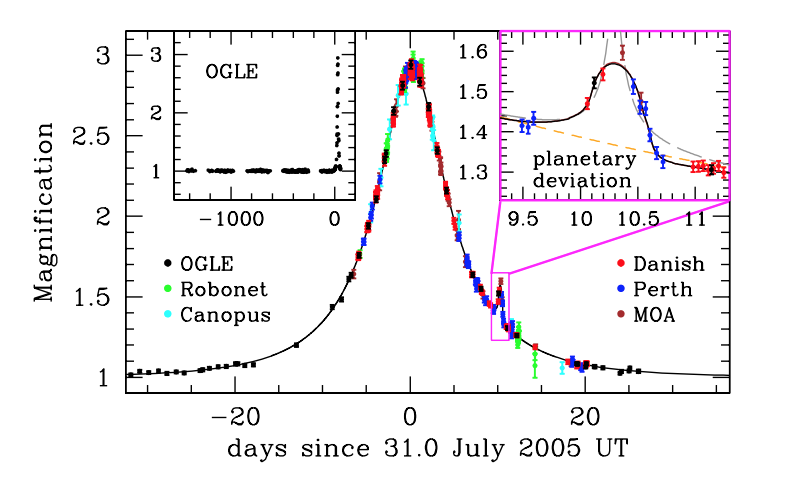
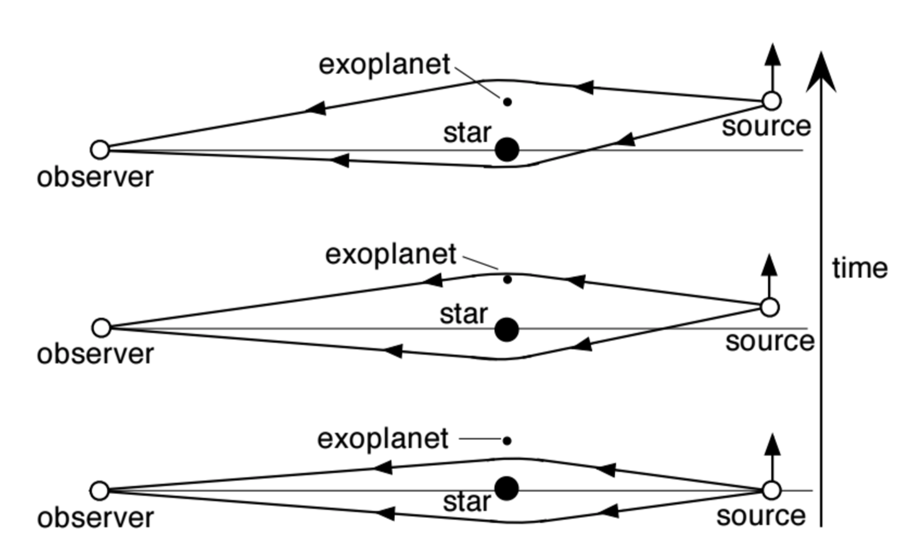
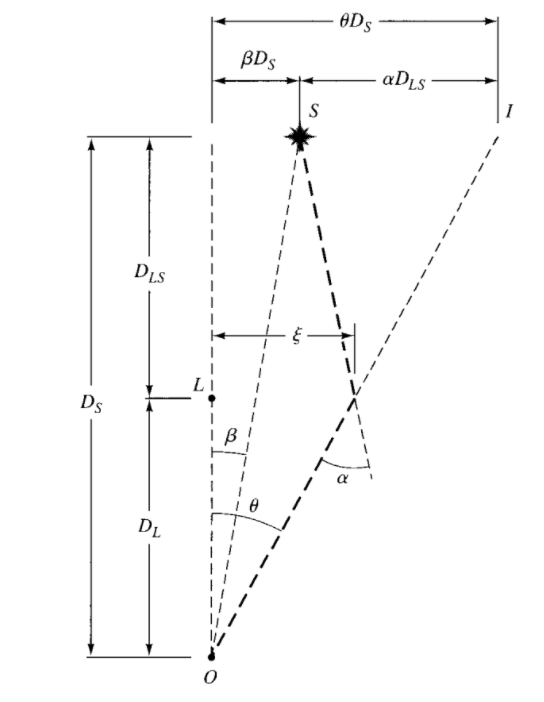
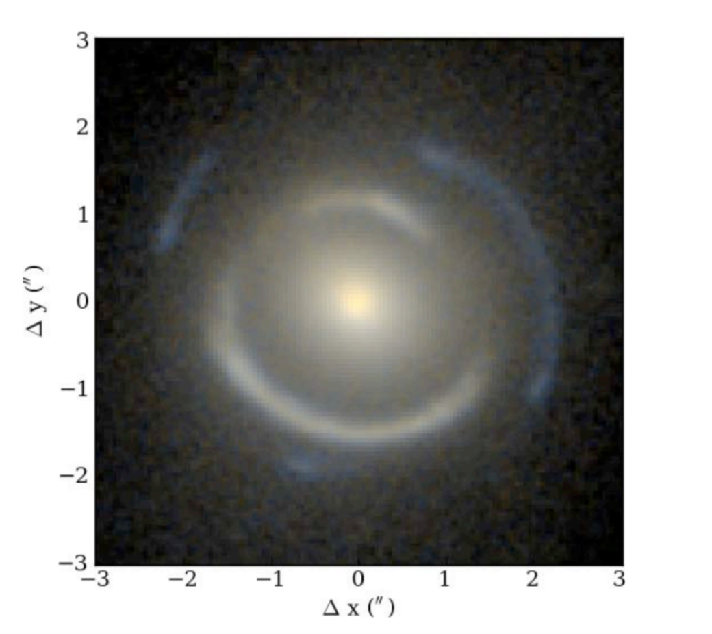

.. _Gravitational_Microlensing:

Gravitational Microlensing
===========

Background
-----------
Planet detection in modern astronomy is prominently done through the observation of transit events - events in which a large planet dims the light of its host star as it passes between the line of sight of the observer and the star. This dimming results in a dip in the lightcurve of the source, indicating the presence of an orbiting companion. Transit events are more susceptible to larger jovian planets, however, as smaller rocky worlds are not large enough to dim the host star's light significantly to be detected from Earth. Gravitational microlensing on the other hand is sensitive to any planetary mass and serves as the most efficient tool to date for detecting smaller worlds within the habitable zone.

Gravitational microlensing occurs when the light from a foreground star (source star) is amplified as a wandering star (lens star) aligns with the line of the sight of the observer and the source star. This is explained by Einstein’s  theory of relativity which states that objects such as stars and planets warp the fabric of spacetime. This curvature allows for the curving of light as it travels around the object (Figure 1). When the lens star has in orbit a planet, the planet serves as an additional lens that causes a blip on the lightcurve (Figure 2).

    Figure 1: Microlensing lightcurve with planet detection. Note the blip on the curve caused by additional magnification from the planet, image from the book `Detection of Extrasolar Planets by Gravitational Microlensing <https://citations.springernature.com/item?doi=10.1007/978-3-540-74008-7_3>`_.

    Figure 2: Diagram of gravitational microlensing event as lensing star aligns between the observer and the source, image from the 2003 book on Gravity by `Hartle <https://ui.adsabs.harvard.edu/abs/2003gieg.book.....H/abstract>`_.

Microlensing Theory
-----------

    Figure 3: Geometry of distances during a microlensing event, observer is denoted as O. Image from the book on Gravity by `Hartle <https://ui.adsabs.harvard.edu/abs/2003gieg.book.....H/abstract>`_.

Microlensing refers to the particular case of gravitational lensing in which the images produced are so close together that they appear as one image as observed from Earth. This is caused by the position of the source and lens star, as during the event the source star aligns behind the lens star (see Figure 3). As this occurs, the light from the source passes on all sides of the lens star, creating several distorted images of the source star. How many images appear during these events is in turn dependent on the number of lensing masses involved, with a single lens producing two images. 

    Figure 4: Event in which the light of multiple distant galaxies bent around the Einstein radius of a lensing galaxy. Axes units are in terms of arcseconds. Image from the book on Gravity by `Hartle <https://ui.adsabs.harvard.edu/abs/2003gieg.book.....H/abstract>`_.

In the event that the source star and the lens star are perfectly aligned, the images create a ring around the lens, known as the Einstein Ring, :math:`R_E` - an example of this is displayed in Figure 4, with the light bending around the Einstein Ring of a distant galaxy. :math:`R_E` is expressed as

.. math:: 
	R_E = \sqrt{\frac{4GMD}{c^2}} 

where :math:`c` is the speed of light, :math:`M` is the lens mass, :math:`G` is Newton's gravitational constant and 

.. math::
	D = \frac{D_{LS}D_{L}}{D_{S}}

where :math:`D_{LS}` is the distance between the lens and the source, :math:`D_{L}` the distance to the lens star, and :math:`D_{S}` the distance to the source. A display of this geometry is in 3. Given the large distances involved, we can use the small angle approximation, and can also assume that the stars are point sources. Following is a derivation of the microlensing parameters assuming the event is a Point Source Point Lens (PSPL).

From Figure 3, we can write the following lens equation:

