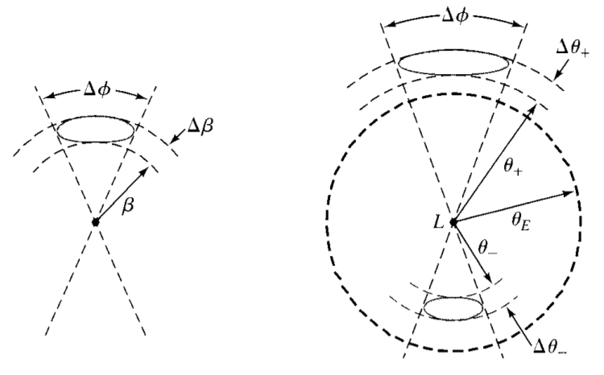
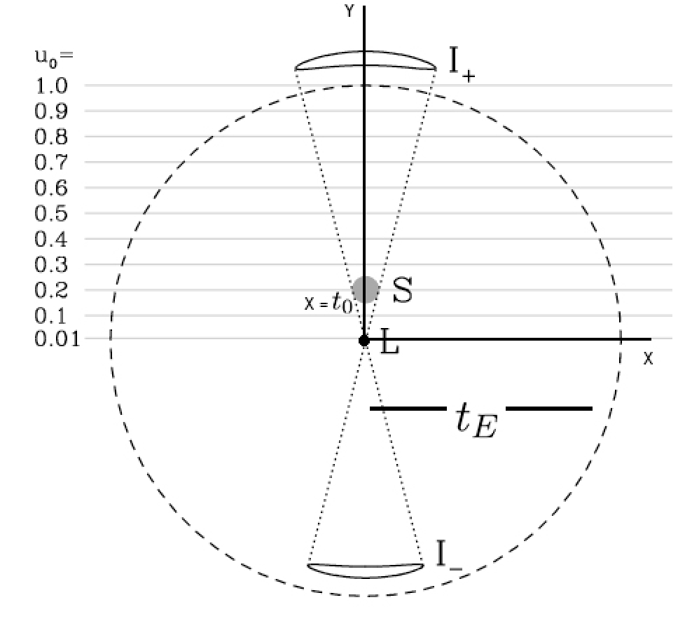
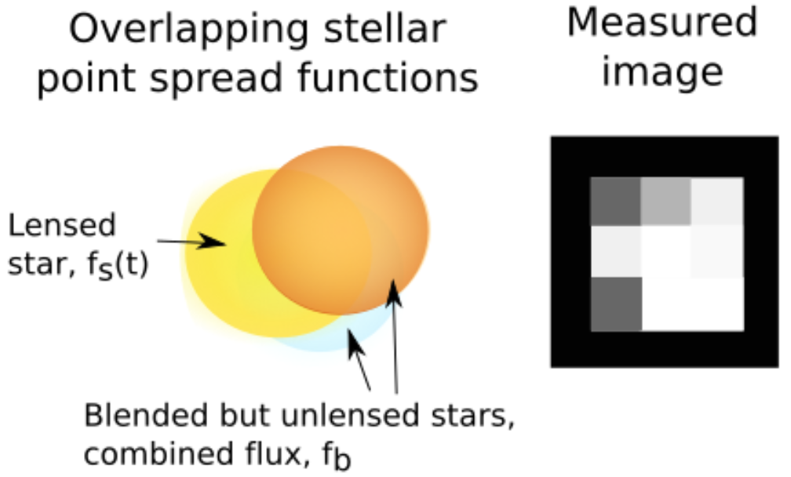
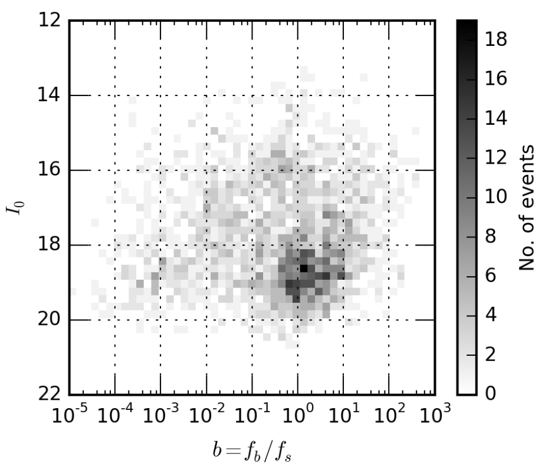
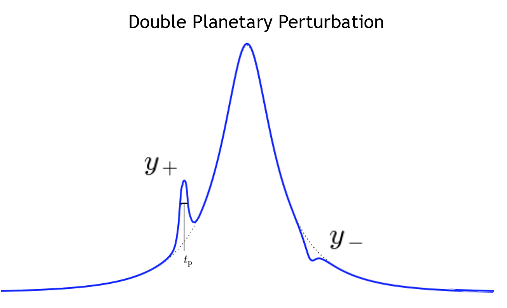

.. _Gravitational_Microlensing:

Gravitational Microlensing
===========

Background
-----------
Planet detection in modern astronomy is prominently done through the observation of transit events - events in which a large planet dims the light of its host star as it passes between the line of sight of the observer and the star. This dimming results in a dip in the lightcurve of the source, indicating the presence of an orbiting companion. Transit events are more susceptible to larger jovian planets, however, as smaller rocky worlds are not large enough to dim the host star's light significantly to be detected from Earth. Gravitational microlensing on the other hand is sensitive to any planetary mass and serves as the most efficient tool to date for detecting smaller worlds within the habitable zone.

Gravitational microlensing occurs when the light from a foreground star (source star) is amplified as a wandering star (lens star) aligns with the line of the sight of the observer and the source star. This is explained by Einstein’s  theory of relativity which states that objects such as stars and planets warp the fabric of spacetime. This curvature allows for the curving of light as it travels around the object (Figure 1). When the lens star has in orbit a planet, the planet serves as an additional lens that causes a blip on the lightcurve (Figure 2).

.. figure:: _static/exo.png
    :align: center
    :width: 1200px

    Figure 1: Microlensing lightcurve with planet detection. Note the blip on the curve caused by additional magnification from the planet, image from the book `Detection of Extrasolar Planets by Gravitational Microlensing <https://citations.springernature.com/item?doi=10.1007/978-3-540-74008-7_3>`_.

.. figure:: _static/ML_diagram.png
    :align: center
    :width: 1200px

    Figure 2: Diagram of gravitational microlensing event as lensing star aligns between the observer and the source, image from the 2003 book on Gravity by `Hartle <https://ui.adsabs.harvard.edu/abs/2003gieg.book.....H/abstract>`_.

Microlensing Theory
-----------

Microlensing refers to the particular case of gravitational lensing in which the images produced are so close together that they appear as one image as observed from Earth. This is caused by the position of the source and lens star, as during the event the source star aligns behind the lens star (see Figure 3). As this occurs, the light from the source passes on all sides of the lens star, creating several distorted images of the source star. How many images appear during these events is in turn dependent on the number of lensing masses involved, with a single lens producing two images. 

.. figure:: _static/distance.png
    :width: 1200px

    Figure 3: Geometry of distances during a microlensing event, observer is denoted as O. Image from the book on gravity by `Hartle <https://ui.adsabs.harvard.edu/abs/2003gieg.book.....H/abstract>`_.

.. figure:: _static/galaxy_ml.png
    :width: 1200px
    Figure 4: Event in which the light of multiple distant galaxies bent around the Einstein radius of a lensing galaxy. Axes units are in terms of arcseconds. Image from the book on gravity by `Hartle <https://ui.adsabs.harvard.edu/abs/2003gieg.book.....H/abstract>`_.

In the event that the source star and the lens star are perfectly aligned, the images create a ring around the lens, known as the Einstein Ring, :math:`R_E` - an example of this is displayed in Figure 4, with the light bending around the Einstein Ring of a distant galaxy. :math:`R_E` is expressed as

.. math:: 
	R_E = \sqrt{\frac{4GMD}{c^2}} 

where :math:`c` is the speed of light, :math:`M` is the lens mass, :math:`G` is Newton's gravitational constant and 

.. math::
	D = \frac{D_{LS}D_{L}}{D_{S}}

where :math:`D_{LS}` is the distance between the lens and the source, :math:`D_{L}` the distance to the lens star, and :math:`D_{S}` the distance to the source. A display of this geometry is in 3. Given the large distances involved, we can use the small angle approximation, and can also assume that the stars are point sources. Following is a derivation of the microlensing parameters assuming the event is a Point Source Point Lens (PSPL).

From Figure 3, we can write the following lens equation:

.. math::
	\theta D_S = \beta D_S + \alpha D_{LS}.

From general relativity (see `Hartle <https://ui.adsabs.harvard.edu/abs/2003gieg.book.....H/abstract>`_), one can derive :math:`\alpha` to be

.. math::
	\alpha = \frac{4GM_L}{\xi c^2},

where :math:`M_L` is the mass of the lens, and :math:`\xi` is the impact parameter. From Figure 3, :math:`\xi` can be expressed as 

.. math::
	\xi = \theta D_{L}

such that the lens equation becomes:

.. math::
	\theta D_S = \beta D_S + \frac{4GM_{L}D_{LS}}{c^2D_{L}D_{S}}.

By defining the angular Einstein radius as

.. math::
	\theta_E = \sqrt{\frac{4GM_{L}D_{LS}}{D_{L}D_{S}}},

the lens equation can be written as

.. math::
	\theta = \beta + \frac{\theta_{E}^2}{\theta}.

This equation can be solved as a quadratic,

.. math::
	\theta^2 - \theta \beta - \theta_{E}^2 = 0.

This equation yields two solutions for :math:`\theta`, such that the positive :math:`\theta` gives the angular position of the image outside :math:`\theta_E`, while the negative solution to :math:`\theta` yields the angular position of the image that lies within :math:`\theta_E`.

.. math::
	\theta\pm = \frac{\beta\pm\sqrt{\beta^2 + 4\theta_{E}^2}}{2}

Figure 5 displays the images created during a microlensing event. The left diagram portrays the solid angle of an image without a lens, whereas the right diagram shows the position :math:`\theta\pm` of the images created by the lens. The solid angle defines the surface of the visible sky that is covered by the source, such that it can be expressed as a surface integral that through the use of the small angle approximation can be defined as:

.. math::
	d\Omega = \int\int_S \sin\beta d\phi d\beta \approx \beta d\phi d\beta

    Figure 5: Image of galaxy if lens (located at :math:`L`) was not present (left). The respective images (at :math:`theta\pm`) during the presence of a lens (right). The source is located at an angle :math:`\beta` from the observer-lens axis with angular dimensions of :math:`\Delta \phi` and :math:`\Delta \theta\pm`. Note that the azimuthal width (:math:`\Delta \phi`) of the image, whether located at :math:`\theta \pm`, is always conserved. Image from the 2003 book by `Hartle <https://citations.springernature.com/item?doi=10.1007/978-3-540-74008-7_3>`_.

Using this we can define the magnification of the event to be the ratio of non-lens to lensed flux -- this yields a proportionality between solid angles,

.. math::
	\frac{I\pm}{I_*} = \frac{\Delta\Omega\pm}{\Delta\Omega_*}

where :math:`I_*` and :math:`\Delta\Omega_*` are the non-lensed intensity and solid angle, respectively. From the solid angle equation, this can be defined as

.. math::
	\frac{\Delta\Omega\pm}{\Delta\Omega_*} = \mathopen|\frac{\theta\pm\Delta\theta\pm\Delta\phi}{\beta\Delta\beta\Delta\phi}\mathopen|.

By introducing the minimum angular impact parameter :math:`u` to be

.. math::
	u =\frac{\beta}{\theta_E},

we can state the lens equation in terms of this impact parmater: 

.. math::
	u = y - \frac{1}{y},

where y :math:`\equiv \frac{\theta}{\theta_E}`, which, when solved for y, yields a quadratic of the form

.. math::
	y^2 - uy - \frac{1}{y} = 0.

The solution to this equation is 

.. math::
	y\pm \frac{u\pm\sqrt{(u^2+4)}}{2}.

Since the surface brightness of the source is conserved for this model, the ratio of solid angles defines the magnification, such that

.. math::
	A\pm = \frac{y\pm}{u} \frac{dy\pm}{du},

where the total magnification is given by

.. math::
	A_{tot} = A_{-} + A_{+}.

The solution to :math:`A\pm` is

.. math::
	A\pm = \frac{1}{4} \bigg[\frac{(u^2 \pm \sqrt(u^2 + 4)^2)}{u\sqrt{(u^2+4)}} \bigg],

and thus :math:`A_{tot}` can be expressed as

.. math::
	A_{tot} = \frac{1}{4}\frac{1}{u\sqrt{u^2+4}} \big[2u^2 + 2(\sqrt{u^2+4})^2\big].

The microlensing magnification as a function of the impact parameter :math:`u` is then

.. math::
	A(u) = \frac{u^2 + 2}{2\sqrt{u^2+4}}.

Thus a PSPL event can be described by three parameters, the timescale (:math:`t_E`), the minimum angular impact parameter (:math:`u_0`), and the event peak time (:math:`t_0`). Since the timescale of the event is the time it takes the source to cross the angular Einstein radius of the lens, we can define :math:`u(t)` as the projected distance between the source and the lens, in terms of :math:`t_E`. By setting up a coordinate system with the lens mass at the center, any position is given by the euclidean distance to the origin, with :math:`u_0` being the analog of :math:`y` (as at :math:`x=0`, :math:`y=u_0`; see Figure 6), and :math:`x = \frac{t - t_0}{t_E}`. This dimensionless parameter is therefore 

.. math::
	u(t) = \sqrt{u_{0}^2+\left(\frac{t -t_0}{t_E}\right)^2}.

    Figure 6: The geometry of a microlensing event as viewed from the perspective of the observer, source pictured at :math:`x = t_0`. Setting the lens (:math:`L`) at the origin, and with a fixed :math:`u_0`, :math:`u(t)` can be be described by the derived equation. The total time it takes to cross the angular Einstein radius is :math:`2t_E`. Modified image, original from `Gaudi <http://adsabs.harvard.edu/abs/2010arXiv1002.0332G>`_.

Thus one can define a microlensing event with the three functions of time (see `Paczynski 1986 <https://ui.adsabs.harvard.edu/abs/1986ApJ...304....1P/abstract>`_). The magnification factor :math:`A(t)` describes the area of the image over the area of the source, with the second parameter being the overall flux :math:`F(t)`, which for our purposes is the apparent magnitude of the entire system in whatever photometric band the data is collected,

.. math::
	A(t) = \frac{u(t)^2+2}{u(t)\sqrt{u(t)^2+4}},

.. math::
	F(t) = A(t) f_{s},

where :math:`f_s` is the source flux, also in apparent magnitude. The third function used is distance between the source and the lens, :math:`u(t)` as derived above.

Blending
-----------
The PSPL model thus far assumes that the source flux in the CCD frame is isolated, such that the flux can be measured independently of any stellar neighbors. Unfortunately the most promising regions for microlensing detection, the Bulge and the Magallenic Clouds, are extremely crowded and the blending of light will yield deceptive results if unaccounted for. Even though stars can't usually be resolved and analyzed as disks, the points of light from the source diffract at the telescope aperture, and the light from the star is spread out over a circle of pixels on the frame. The shape of this circle is determined by the point spread function (PSF) of the star, which will contain a certain full-width-half-maximum (FWHM) that is dependent on the telescope and weather conditions at the time. If two stars lie at close angular separation from our line of sight, their PSF will overlap and we say the event is blended (Figure 7). 

    Figure 7: Blending occurs when neighboring stars overlap in the CCD frame. Only the light from one star exhibits microlensing behavior, making it important to subtract the additional blend flux to model the event correctly.

To account for blending, the belnd flux is added to the flux equation (:math:`F(t)`)

.. math::
	F(t) = A(t) f_{s} + f_b,

where :math:`f_b` is the additional blend flux (`see Han 1999 <https://arxiv.org/abs/astro-ph/9810401>`_). The overall observed flux is calculated as 

.. math::
	A_{obs}(t) = \frac{f_sA(t)+f_b}{f_s+f_b}.

Taking :math:`b = \frac{f_b}{f_s}`, :math:`A_{obs}(t)` becomes 

.. math::
	A_{obs}(t) = \frac{A(t)+b}{1 + b}.

In the event that the source causing the blending is not constant (e.g. variable star), :math:`f_b` must be an appropriate function of time, like a sinusoid for a long period variable star. Ultimately, accounting for blending requires guessing initial event parameters to derive an initial model for :math:`A(t)`, and inferring :math:`f_b` and :math:`f_s` by applying a :math:`\chi^2` test. While constraining :math:`b` through the fitting process is the most common method for dealing with blending, it is also possible to actually resolve the stars contributing $f_b$ through the use of space or large ground-based telescopes. For our purposes of modeling microlensing, we only had to set a value for the blending coefficient :math:`b`. From a previous analysis of microlensing events performed by `Richards et al 2011 <https://arxiv.org/abs/1101.1959>`_, we determined a blending coefficient between 1 and 10 was reasonable for modeling PSPL events (Figure 8).

    Figure 8: Baseline magnitude as a function of the blending coefficient :math:`b`. This microlensing data was taken by OGLE III and compiled between 2003 and 2008 by by `Richards et al 2011 <https://arxiv.org/abs/1101.1959>`_. For modeling events, we took :math:`1 \leq b \leq 10`.

While in reality a lens is not a point source, this simple model serves to illuminate the basic fundamentals behind the microlensing theory, and was sufficient for our modeling of microlensing events, as described in Section 3.

Planetary Perturbations
-----------
`Gaudi 1997 <https://arxiv.org/abs/astro-ph/9610123>`_ demonstrated how the mass of a planet could be detected when perturbation occurs. Any planet that orbits the lensing star is detectable (to first order) only if it is located at either :math:`y\pm`, denoted as :math:`\theta\pm` in Figure 6. If the planet is located in the Minor image (:math:`y_{-}`), the perturbation tends to destroy it, resulting in a decrease in magnification. On the other hand, if the planet is located in the Major image (:math:`y_{+}`), it will increase the magnification (Figure 9).

    Figure 9: Example of a microlensing lightcurve with rare double planetary perturbation. An increase in magnification occurs when a planet is near the Major image, with a decrease occuring when a planet gets near the Minor image. We can approximate :math:`t_p` as the FWHM of the planetary signal. Modified image, original by `J Yee <http://www.microlensing-source.org/concept/extracting-parameters/>`_.

Another utility of our PSPL model is that it allows us to estimate the mass ratio between the lens star and a planetary companion by using the relation

.. math::
	\theta_p = \left( \frac{m_p}{M} \right)^\frac{1}{2} \theta_E,

where :math:`\theta_E` is still the Einstein ring of the lensing star, :math:`\theta_p` is the planetary Einstein ring, and :math:`m_p` \& :math:`M` are the mass of the planet and its host (see `Gaudi 1997 <https://arxiv.org/abs/astro-ph/9610123>`_). From our model, the ratio of Einstein rings should be proportional to the timescales of both the event and perturbation, thus also proportional to the square root of the mass ratio,

.. math::
	\left( \frac{\theta_p}{\theta_E} \right) = \left( \frac{t_p}{t_E} \right) = \left( \frac{m_p}{M} \right)^\frac{1}{2}.

Therefore, by measuring the mass of a star (through luminosity-temperature relation and/or spectral data), we can measure the mass of a planetary companion as 

.. math::
	m_p = \left( \frac{t_p}{t_E} \right)^2 M.

As microlensing is sensitive to any planetary mass, it remains the most promising tool to-date for detecting small, rocky worlds within the habitable zone of their host star.

